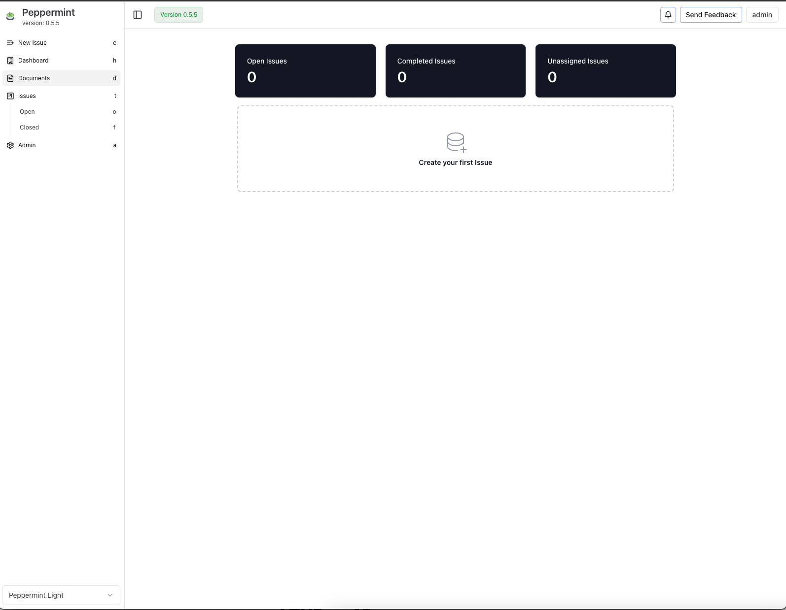

<!-- generated -->

# Peppermint

1-Click installation template for Peppermint on Easypanel

## Description

Peppermint is a cutting-edge, open-source issue management and helpdesk platform designed to rival Jira and Zendesk while remaining cost-effective and highly customizable. Built with the user in mind, Peppermint empowers teams to manage support tickets, customer requests, and projects with efficiency and ease.

## Instructions

Default credentials are; email; admin@admin.com, password; 1234

## Features

- Mailbox Integration: Automatically convert emails into support tickets using SMTP/IMAP for streamlined ticket management.
- Third-Party Integrations: Connect Peppermint to external tools and services through webhooks and integrations with providers like email.
- Analytics and Reporting: Gain insights into ticket performance, customer trends, and team productivity with built-in analytics and reporting tools.
- OIDC Authentication: Securely authenticate users by connecting to your existing identity provider through OIDC.
- Lightweight and Scalable: Designed to run efficiently on low-end hardware while being scalable for larger deployments using Docker and Kubernetes.

## Links

- [Website](https://peppermint.sh/)
- [Github](https://github.com/Peppermint-Lab/peppermint)
- [Template Source](https://github.com/easypanel-io/templates/tree/main/templates/peppermint)

## Options

Name | Description | Required | Default Value
-|-|-|-
App Service Name | - | yes | peppermint
App Service Image | - | yes | pepperlabs/peppermint:latest

## Screenshots

## Change Log

- 2024-12-25 – Template Release

## Contributors

- [Ahson Shaikh](https://github.com/Ahson-Shaikh)
