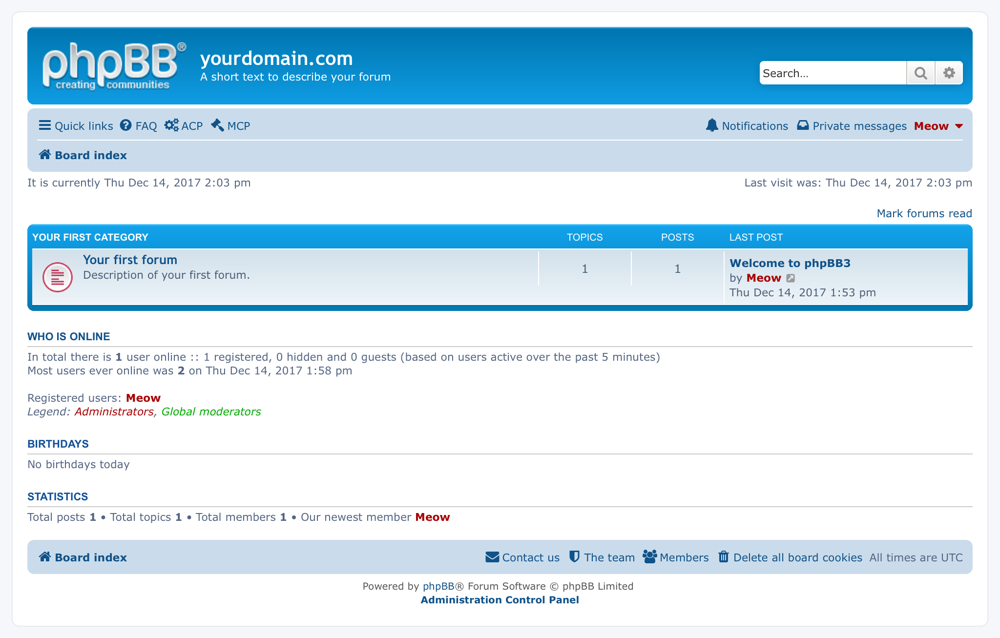

<!-- generated -->

# phpBB

1-Click installation template for phpBB on Easypanel

## Description

phpBB is a free and open-source bulletin board software that enables you to create online communities and discussion forums. It offers a highly customizable platform with a user-friendly interface that supports multiple languages and includes features like custom BBCode, private messaging, search functionality, and user groups. The Bitnami phpBB container provides a ready-to-use instance of phpBB with all its dependencies, configured for security and performance. This deployment includes both the phpBB application and a MariaDB database for storing your forum data.

## Instructions

Login to the phpBB forum via the provided URL. During the first login, use the username &quot;admin&quot; and the passowrd is &quot;admin&quot;

## Benefits

- Easy Forum Creation: Set up a fully functional discussion forum without complex configuration or technical knowledge.
- Highly Customizable: Tailor your forum's appearance and functionality with thousands of styles, extensions, and language packs.
- Active Community: Join a large and active community of users and developers who contribute to the platform's growth and improvement.

## Features

- User Management: Create user groups with different permission levels and manage user accounts with comprehensive moderation tools.
- Mobile-Responsive Design: Offer a seamless browsing experience across all devices with phpBB's responsive design.
- Powerful Search Functionality: Enable users to quickly find content using the built-in search system with advanced filtering options.
- Anti-Spam Measures: Protect your forum from unwanted content with various anti-spam tools and CAPTCHA verification.

## Links

- [Website](https://www.phpbb.com/)
- [Documentation](https://www.phpbb.com/support/documentation/)
- [Docker Hub](https://hub.docker.com/r/bitnami/phpbb)
- [Template Source](https://github.com/easypanel-io/templates/tree/main/templates/phpbb)

## Options

Name | Description | Required | Default Value
-|-|-|-
App Service Name | - | yes | phpbb
App Service Image | - | yes | bitnami/phpbb:3.3.12

## Screenshots

## Change Log

- 2025-03-21 – Initial template release

## Contributors

- [Ahson Shaikh](https://github.com/Ahson-Shaikh)
