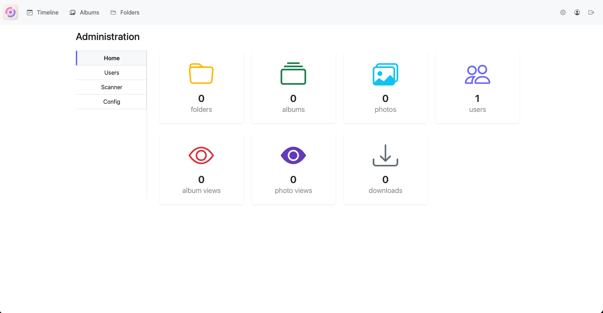

<!-- generated -->

# Pic-O

1-Click installation template for Pic-O on Easypanel

## Description

Pic-O is a modern self-hosted photo gallery application with a clean web interface for browsing and organizing image collections. This template deploys Pic-O with a MariaDB backend and preconfigured application settings so the app and database communicate correctly at first startup.

## Instructions

Deploy the template and wait until both services are healthy, then open the configured domain to access the Pic-O interface and complete initial setup in the web UI.

## Benefits

- Simple Photo Stack: Run Pic-O with a straightforward app plus database architecture.
- Persistent Media Storage: Store photos and application data in mounted volumes for long term use.
- Self-Hosted Control: Keep your image data and metadata in your own infrastructure.

## Features

- MariaDB Backed: Uses MariaDB for durable application metadata and configuration state.
- Dedicated Photo Mount: Maps a persistent storage path to /var/www/resources/photos.
- Dedicated App Storage Mount: Maps a persistent path to /var/www/storage/app.

## Links

- [Documentation](https://github.com/Xirt/Pic-O#readme)
- [GitHub](https://github.com/Xirt/Pic-O)
- [Template Source](https://github.com/easypanel-io/templates/tree/main/templates/pic-o)

## Options

Name | Description | Required | Default Value
-|-|-|-
App Service Name | - | yes | app
App Service Image | - | yes | xirtnl/pic-o:latest

## Screenshots

## Change Log

- 2026-04-01 – Initial template release

## Contributors

- [Ahson Shaikh](https://github.com/Ahson-Shaikh)
