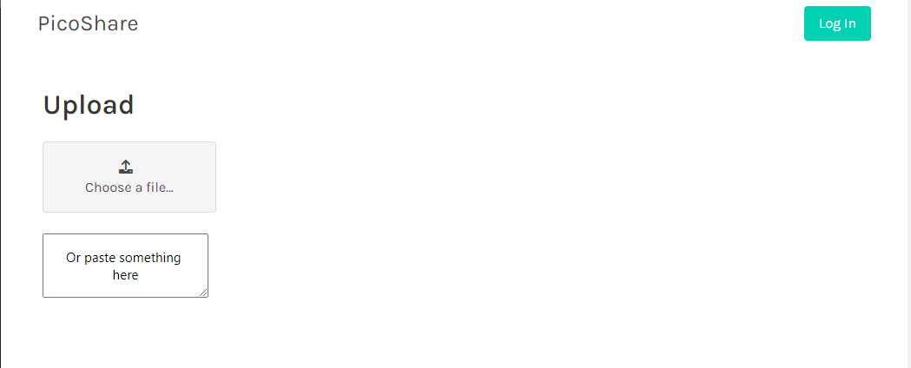

<!-- generated -->

# Picoshare

1-Click installation template for Picoshare on Easypanel

## Description

Picoshare is a lightweight, self-hosted file-sharing platform designed for simplicity and privacy. It provides a minimalistic interface for uploading, sharing, and managing files, without the complexity of traditional cloud storage services. Picoshare emphasizes ease of use and security, making it an ideal solution for personal or small team file-sharing needs. It supports a variety of file types and provides a secure, private environment for sharing files with full control over your data.

## Benefits

- Lightweight File Sharing: Picoshare offers a lightweight and self-hosted solution for sharing files without the overhead of complex cloud storage services.
- Privacy and Security: With Picoshare, your files remain private and secure on your server, giving you full control over your data.
- Simple User Interface: Picoshare provides a clean, minimalistic interface that focuses on ease of use, making file sharing straightforward and hassle-free.

## Features

- Secure File Sharing: Picoshare ensures secure file transfers, giving you peace of mind when sharing sensitive documents or media.
- Support for Various File Types: Share a wide range of file types, including documents, images, videos, and more, without compatibility concerns.
- Self-Hosted Environment: Host Picoshare on your own server, ensuring privacy and complete control over your file-sharing platform.
- Minimal Resource Usage: Picoshare is designed to be lightweight, making it efficient to run even on low-resource systems.
- Easy Setup and Maintenance: Picoshare is easy to set up and maintain, with clear documentation and minimal configuration required.

## Links

- [Website](https://picoshare.net/)
- [Documentation](https://github.com/mtlynch/picoshare/wiki)
- [Github](https://github.com/mtlynch/picoshare)
- [Template Source](https://github.com/easypanel-io/templates/tree/main/templates/picoshare)

## Options

Name | Description | Required | Default Value
-|-|-|-
App Service Name | - | yes | picoshare
App Service Image | - | yes | mtlynch/picoshare:1.4.5
Auth Passphrase | - | yes | 

## Screenshots

## Change Log

- 2025-01-16 – First Release

## Contributors

- [Ahson Shaikh](https://github.com/Ahson-Shaikh)
