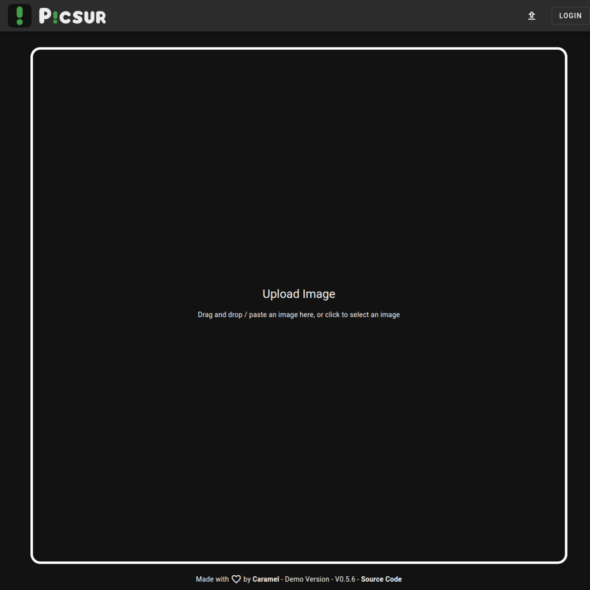

<!-- generated -->

# Picsur

1-Click installation template for Picsur on Easypanel

## Description

Picsur is a simple and fast image hosting service. It provides a user-friendly interface for uploading, managing, and sharing images with support for various image formats and features.

## Benefits

- Simple Image Hosting: Picsur provides a simple and fast way to host and share images with a user-friendly interface.
- Secure by Default: Built with security in mind, providing secure image storage and sharing capabilities.
- Easy to Use: Simple configuration and easy to set up, making it perfect for personal or small team use.

## Features

- Image Upload: Simple and fast image upload with support for various image formats.
- User Management: User authentication and management with admin capabilities.
- Image Management: Easy management of uploaded images with deletion and sharing options.
- Customizable: Configurable file size limits and JWT settings for security.
- PostgreSQL Backend: Uses PostgreSQL for reliable and scalable data storage.
- Containerized: Easy to deploy and manage in containerized environments.

## Links

- [Github](https://github.com/caramelfur/picsur)
- [Documentation](https://github.com/caramelfur/picsur#readme)
- [Template Source](https://github.com/easypanel-io/templates/tree/main/templates/picsur)

## Options

Name | Description | Required | Default Value
-|-|-|-
App Service Name | - | yes | picsur
App Service Image | - | yes | ghcr.io/caramelfur/picsur:0.5.6

## Screenshots

## Change Log

- 2025-04-28 – First Release

## Contributors

- [Ahson Shaikh](https://github.com/Ahson-Shaikh)
