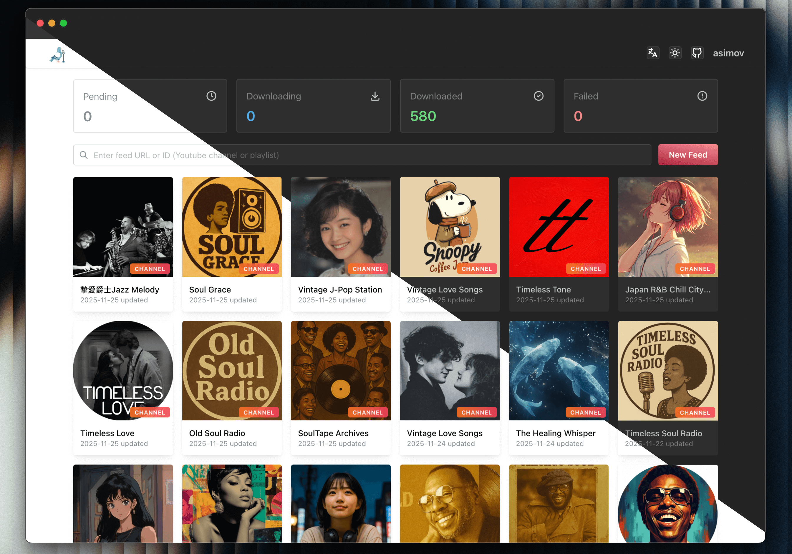

<!-- generated -->

# Pigeon Pod

1-Click installation template for Pigeon Pod on Easypanel

## Description

Pigeon Pod is a self-hosted application that converts YouTube channels or playlists into podcast feeds. It supports automatic syncing of new uploads, backfilling historical content, media downloads, and secure RSS feeds compatible with standard podcast players. Built with Spring Boot, Pigeon Pod provides a web interface for managing YouTube subscriptions and generates podcast-compatible RSS feeds that work with any standard podcast player. Perfect for podcast enthusiasts who want to listen to YouTube content as podcasts while maintaining complete control over their data and subscriptions.

## Instructions

Login using the credentials; username=root, password=Root@123

## Benefits

- YouTube to Podcast Conversion: Convert any YouTube channel or playlist into a podcast feed that works with standard podcast players and apps.
- Automatic Syncing: Automatically sync new uploads from subscribed YouTube channels, keeping your podcast feed up-to-date without manual intervention.
- Self-Hosted Control: Complete control over your podcast feeds and downloaded media with no reliance on external services or subscriptions.
- Historical Content: Backfill historical content from YouTube channels, allowing you to access older videos as podcast episodes.
- Standard RSS Feeds: Generates standard RSS feeds compatible with all major podcast players including Apple Podcasts, Spotify, and more.

## Features

- YouTube Channel Subscription: Subscribe to YouTube channels or playlists and automatically convert them into podcast feeds.
- Media Download: Download audio and video files from YouTube for offline access and podcast playback.
- Web Interface: User-friendly web interface for managing subscriptions, viewing download progress, and configuring settings.
- SQLite Database: Lightweight SQLite database for storing subscription data and metadata without requiring a separate database server.
- RSS Feed Generation: Automatically generates secure RSS feeds that work with any standard podcast player application.
- Cover Art Management: Downloads and manages cover art for podcast episodes, enhancing the listening experience.

## Links

- [GitHub](https://github.com/aizhimou/pigeon-pod)
- [Website](https://pigeonpod.cloud)
- [Guides](https://pigeonpod.cloud/guides/)
- [Template Source](https://github.com/easypanel-io/templates/tree/main/templates/pigeon-pod)

## Options

Name | Description | Required | Default Value
-|-|-|-
App Service Name | - | yes | pigeon-pod
App Service Image | - | yes | ghcr.io/aizhimou/pigeon-pod:release-1.19.10

## Screenshots

## Change Log

- 2026-01-15 – Template Release

## Contributors

- [Ahson Shaikh](https://github.com/Ahson-Shaikh)
