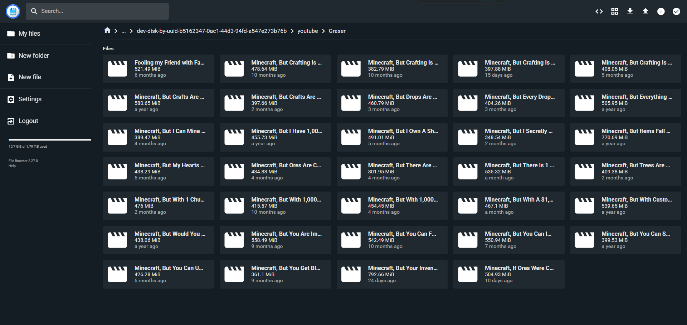

<!-- generated -->

# Pinchflat

1-Click installation template for Pinchflat on Easypanel

## Description

Pinchflat is a modern, self-hosted media management and download application designed for organizing and managing your digital media collection. It provides an intuitive web interface for downloading, organizing, and accessing your media files with support for various formats and sources. Pinchflat offers powerful features for media discovery, automated downloads, and collection management in a clean, user-friendly environment.

## Benefits

- Media Management: Comprehensive media management solution for organizing, downloading, and accessing your digital media collection with powerful search and filtering capabilities.
- Self-Hosted Solution: Complete control over your media collection with a self-hosted solution that keeps your files private and secure on your own infrastructure.
- Automated Downloads: Automated media downloading capabilities with support for various sources and formats to streamline your media collection process.
- Web Interface: Modern web-based interface accessible from any device with responsive design and intuitive navigation for easy media management.

## Features

- Media Organization: Advanced media organization features with custom categories, tags, and metadata management for efficient collection browsing.
- Download Management: Powerful download management with queue support, progress tracking, and automated retry mechanisms for reliable media acquisition.
- Search and Discovery: Advanced search capabilities with full-text search, filtering, and discovery features to quickly find your media content.
- Multi-Format Support: Support for various media formats and sources with automatic format detection and conversion capabilities.
- User Management: Built-in user management system with role-based access control and permission management for secure multi-user environments.
- API Integration: Comprehensive REST API for integration with other applications and custom automation workflows.

## Links

- [GitHub](https://github.com/kieraneglin/pinchflat)
- [Docker Hub](https://hub.docker.com/r/kieraneglin/pinchflat)
- [Template Source](https://github.com/easypanel-io/templates/tree/main/templates/pinchflat)

## Options

Name | Description | Required | Default Value
-|-|-|-
App Service Name | - | yes | pinchflat
App Service Image | Pinchflat Docker image | yes | ghcr.io/kieraneglin/pinchflat:v2025.6.6

## Screenshots

## Change Log

- 2025-09-11 – Initial Template Release (v2025.6.6)

## Contributors

- [Ahson Shaikh](https://github.com/Ahson-Shaikh)
