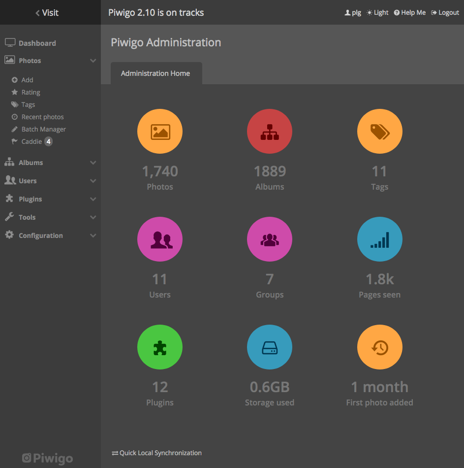

<!-- generated -->

# piwigo

1-Click installation template for piwigo on Easypanel

## Description

Piwigo is a powerful, self-hosted photo gallery solution designed for managing and organizing your image collections efficiently. It provides a user-friendly web interface, supports a vast array of plugins for extended functionality, and offers advanced photo organization features such as albums, tags, and batch processing. With Piwigo, you can maintain full control over your photo storage and sharing.

## Instructions

Configure the database in the installation wizard.

## Benefits

- Efficient Photo Management: Piwigo enables users to manage large collections of photos with advanced features like batch editing, categorization, and tagging.
- Self-Hosted Solution: Retain full control over your photos with a self-hosted gallery solution, ensuring privacy and flexibility.
- Customizable & Extendable: Customize your gallery with themes and extend its functionality using community-built plugins.

## Features

- Album Organization: Structure your images into albums and sub-albums for easy management.
- Tagging System: Add tags to images for faster search and filtering.
- User Access Control: Manage permissions and access levels for different users.
- Plugins & Themes: Extend Piwigo’s capabilities with plugins and personalize it with themes.
- Batch Processing: Modify multiple photos at once, saving time on large galleries.
- API Access: Integrate Piwigo with other applications through its API.
- Mobile Compatibility: Access and manage your gallery from mobile devices seamlessly.

## Links

- [Website](https://piwigo.org/)
- [DockerHub](https://hub.docker.com/r/linuxserver/piwigo)
- [Template Source](https://github.com/easypanel-io/templates/tree/main/templates/piwigo)

## Options

Name | Description | Required | Default Value
-|-|-|-
App Service Name | - | yes | piwigo
App Service Image | - | yes | lscr.io/linuxserver/piwigo:15.4.0

## Screenshots

## Change Log

- 2025-02-24 – Template Release

## Contributors

- [Ahson Shaikh](https://github.com/Ahson-Shaikh)
