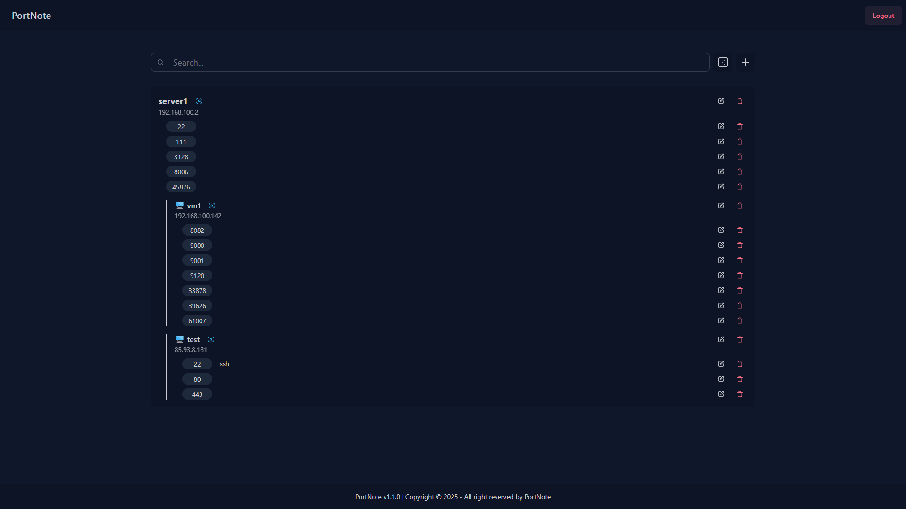

<!-- generated -->

# PortNote

1-Click installation template for PortNote on Easypanel

## Description

PortNote is a self-hosted port tracking application that helps you keep track of used ports across your servers and VMs. Stop juggling spreadsheets and guessing which service uses which port — PortNote gives you a clear, organized view of your entire port landscape. Add your servers via a sleek web interface, assign and document port usage across all systems, and avoid conflicts before they happen.

## Benefits

- Port Conflict Prevention: Avoid port conflicts before they happen by maintaining a clear, organized view of your entire port landscape across all servers and VMs.
- Infrastructure Organization: Replace spreadsheets and manual tracking with a structured, web-based interface for managing port assignments and documentation.
- Self-Hosted Control: Keep your port tracking data completely private and secure on your own server with no external dependencies or data sharing.

## Features

- Server and VM Management: Add and manage your servers and VMs through a sleek web interface, organizing your entire infrastructure in one centralized location.
- Port Assignment Tracking: Assign and document port usage across all systems with detailed information about which services use which ports.
- Random Port Generator: Generate random available ports to help you find unused ports for new services and avoid conflicts.
- Secure Authentication: JWT-based authentication system with secure login credentials to protect your infrastructure data and port assignments.
- Background Processing: Dedicated agent service for handling background tasks, automation, and advanced port management features.
- Database Storage: Reliable PostgreSQL database for storing server information, port assignments, and application state with data persistence.

## Links

- [Github](https://github.com/crocofied/PortNote)
- [Template Source](https://github.com/easypanel-io/templates/tree/main/templates/portnote)

## Options

Name | Description | Required | Default Value
-|-|-|-
App Service Name | - | yes | portnote
Web Service Image | - | yes | haedlessdev/portnote:1.2.0
Agent Service Image | - | yes | haedlessdev/portnote-agent:1.2.0
Login Username | Username for accessing the application | no | admin
Login Password | Password for accessing the application (leave empty for auto-generation) | no | 

## Screenshots

## Change Log

- 2025-09-17 – Template Release (1.2.0)

## Contributors

- [Ahson Shaikh](https://github.com/Ahson-Shaikh)
