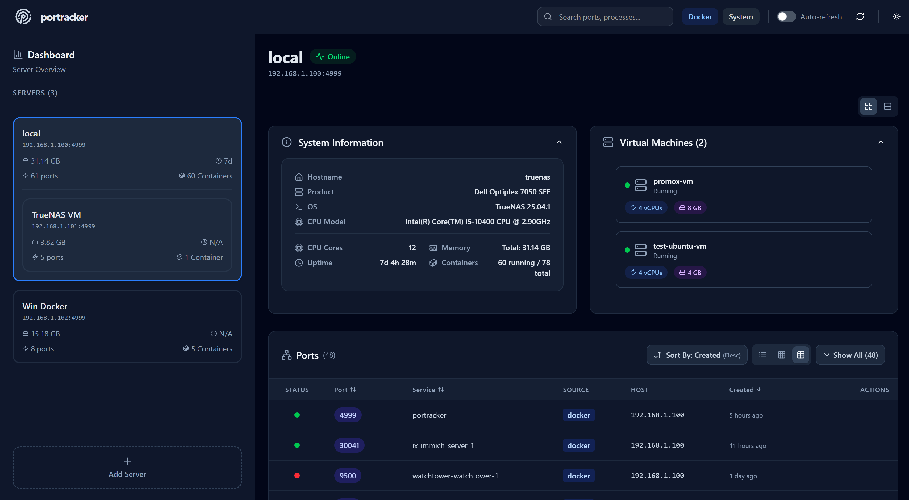

<!-- generated -->

# Portracker

1-Click installation template for Portracker on Easypanel

## Description

Portracker is a self-hosted port tracking and monitoring application that provides real-time visibility into port usage across your infrastructure. It automatically discovers and tracks ports used by services running on your system, including Docker containers, and provides a comprehensive dashboard for port management and conflict detection. Perfect for DevOps teams and system administrators who need to maintain organized port assignments.

## Benefits

- Real-Time Port Monitoring: Automatically discover and track ports used by services running on your system with real-time updates and comprehensive port visibility.
- Docker Integration: Seamlessly integrate with Docker to track container ports and service assignments with automatic discovery capabilities.
- Conflict Prevention: Identify port conflicts before they happen and maintain organized port assignments across your entire infrastructure.

## Features

- Automatic Port Discovery: Automatically discover ports used by running services and containers without manual configuration or port scanning.
- Docker Socket Integration: Read-only access to Docker socket for discovering services running in Docker containers and their port assignments.
- System Port Detection: Advanced system-level port detection with required permissions for accessing host processes and port information.
- TrueNAS Integration: Optional TrueNAS API integration for enhanced features and infrastructure management capabilities.
- Data Persistence: Reliable data storage for port tracking information, service configurations, and historical port usage data.
- Web Dashboard: Clean and intuitive web interface for viewing port assignments, managing services, and monitoring port usage across your infrastructure.

## Links

- [Github](https://github.com/mostafawahied/portracker)
- [Template Source](https://github.com/easypanel-io/templates/tree/main/templates/portracker)

## Options

Name | Description | Required | Default Value
-|-|-|-
App Service Name | - | yes | portracker
App Service Image | - | yes | mostafawahied/portracker:1.1
Enable TrueNAS Integration | Enable enhanced TrueNAS features and API integration | no | false
TrueNAS API Key | API key for TrueNAS integration (required if TrueNAS is enabled) | no | 

## Screenshots

## Change Log

- 2025-09-17 – Template Release (v1.1)

## Contributors

- [Ahson Shaikh](https://github.com/Ahson-Shaikh)
