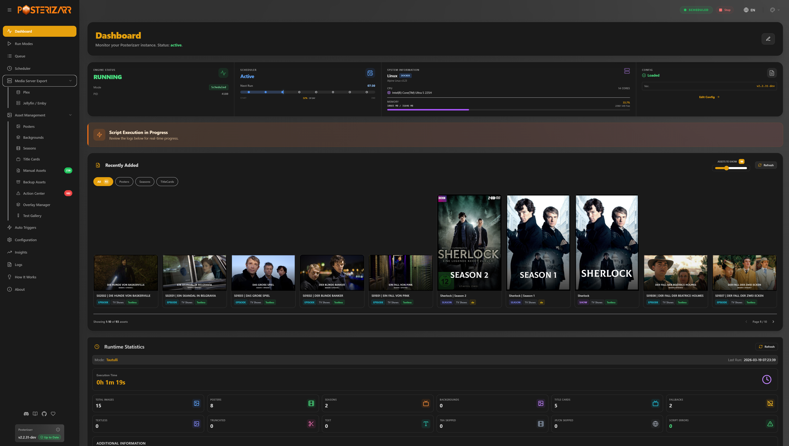

<!-- generated -->

# Posterizarr

1-Click installation template for Posterizarr on Easypanel

## Description

Posterizarr automates creation and management of textless posters for Plex, Jellyfin, and Emby libraries. This template deploys the official Posterizarr container with persistent paths for config and generated assets.

## Instructions

After deployment, open your domain and complete setup in the web UI. Mounts are already configured for /config, /assets, /assetsbackup, and /manualassets.

## Benefits

- Automated poster workflows: Build and refresh media artwork automatically from your configured sources.
- Works with major media servers: Supports Plex, Jellyfin, and Emby workflows in one application.
- Persistent asset storage: Keeps config and generated poster assets across restarts and upgrades.

## Features

- Web UI control panel: Configure providers, monitor runs, and manage poster processing in-browser.
- External automation hooks: Integrates with Sonarr, Radarr, and Tautulli automation flows.
- Multiple asset directories: Separate mounts for active assets, backups, and manual asset overrides.

## Links

- [Website](https://fscorrupt.github.io/posterizarr/)
- [Documentation](https://fscorrupt.github.io/posterizarr/installation/)
- [GitHub](https://github.com/fscorrupt/posterizarr)
- [Container registry](https://github.com/fscorrupt/posterizarr/pkgs/container/posterizarr)
- [Template Source](https://github.com/easypanel-io/templates/tree/main/templates/posterizarr)

## Options

Name | Description | Required | Default Value
-|-|-|-
App Service Name | - | yes | posterizarr
Posterizarr Image | - | yes | ghcr.io/fscorrupt/posterizarr:2.2.40
Timezone | - | no | Europe/Berlin
RUN_TIME | Keep disabled for always-on mode | no | disabled
ARR_WAIT_TIME (seconds) | - | no | 300
Disable UI | - | no | false

## Screenshots

## Change Log

- 2026-04-07 – Initial template release
- 2026-05-05 – Version bumped to 2.2.40

## Contributors

- [Ahson Shaikh](https://github.com/Ahson-Shaikh)
