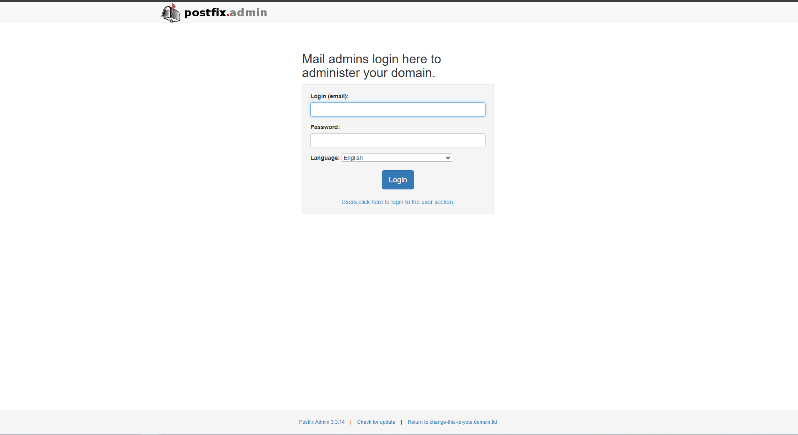

<!-- generated -->

# PostfixAdmin

1-Click installation template for PostfixAdmin on Easypanel

## Description

PostfixAdmin is a robust, web-based administration interface for managing mail servers using Postfix. It allows you to easily manage virtual domains, mailboxes, and aliases through an intuitive and flexible interface. PostfixAdmin supports advanced features like quota management, domain statistics, and DKIM integration, making it an ideal tool for administrators of self-hosted email solutions.

## Instructions

To create an admin user, run the following commands in the PostfixAdmin container &quot;chmod +x /var/www/html/scripts/postfixadmin-cli&quot; and &quot;/var/www/html/scripts/postfixadmin-cli admin add&quot;. This will create a new admin user for accessing the PostfixAdmin interface.

## Benefits

- Simplified Email Administration: PostfixAdmin provides an easy-to-use web interface for managing mail servers, saving time and effort for administrators.
- Advanced Mail Management: Manage virtual domains, aliases, quotas, and DKIM settings with comprehensive support for advanced features.
- Self-Hosted Solution: Stay in control of your email infrastructure with a self-hosted solution that ensures privacy and customization.

## Features

- Virtual Domain Management: Easily create and manage virtual domains and mailboxes through the PostfixAdmin interface.
- Quota and Alias Support: Set mailbox quotas and create email aliases for efficient email handling.
- DKIM and SPF Integration: Enhance email authentication with built-in support for DKIM and SPF configuration.
- Domain Statistics: Monitor email usage and domain statistics directly from the PostfixAdmin interface.

## Links

- [Documentation](https://postfix-configuration.readthedocs.io/en/latest/postfixadmin/)
- [GitHub](https://github.com/postfixadmin/postfixadmin)
- [Template Source](https://github.com/easypanel-io/templates/tree/main/templates/postfixadmin)

## Options

Name | Description | Required | Default Value
-|-|-|-
App Service Name | - | yes | postfixadmin
App Service Image | - | yes | postfixadmin:3.3.14-apache
SMTP Server | - | yes | localhost
SMTP Port | - | yes | 25

## Screenshots

## Change Log

- 2024-12-02 – Template Release

## Contributors

- [Ahson Shaikh](https://github.com/Ahson-Shaikh)
