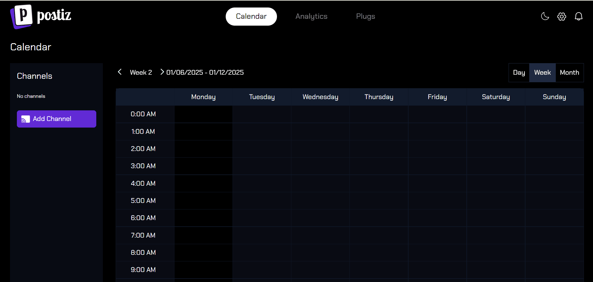

<!-- generated -->

# Postiz

1-Click installation template for Postiz on Easypanel

## Description

Postiz is a modern, self-hosted social media management platform that helps you schedule, publish, and analyze content across multiple social networks. It provides a unified dashboard for managing posts, tracking engagement, and optimizing your social media strategy.

## Instructions

You can modify the settings by adding the env variables provided.

## Benefits

- Centralized Management: Manage all your social media accounts from a single dashboard
- Content Scheduling: Plan and schedule posts across multiple platforms in advance
- Analytics & Insights: Track performance and engagement metrics across all platforms
- Team Collaboration: Work together with your team on content creation and approval

## Features

- Multi-platform Support: Connect and manage accounts on major social networks
- Content Calendar: Visual calendar for planning and scheduling posts
- Media Library: Organize and manage your media assets
- Analytics Dashboard: Comprehensive analytics and reporting tools
- Content Templates: Create and save reusable content templates
- Approval Workflows: Set up custom approval processes for content
- API Access: Integrate with other tools through RESTful API

## Links

- [Website](https://postiz.com)
- [Documentation](https://docs.postiz.com)
- [GitHub](https://github.com/postiz/postiz)
- [Docker Hub](https://hub.docker.com/r/postiz/postiz)
- [Environment Variables](https://github.com/gitroomhq/postiz-app/blob/main/.env.example)
- [Template Source](https://github.com/easypanel-io/templates/tree/main/templates/postiz)

## Options

Name | Description | Required | Default Value
-|-|-|-
App Service Name | - | yes | postiz
App Service Image | - | yes | ghcr.io/gitroomhq/postiz-app:v2.11.3

## Screenshots

## Change Log

- 2025-04-28 – Initial release
- 2025-07-24 – Version bumped to v1.65.7
- 2025-12-29 – Version bumped to v2.11.3

## Contributors

- [Ahson Shaikh](https://github.com/Ahson-Shaikh)
