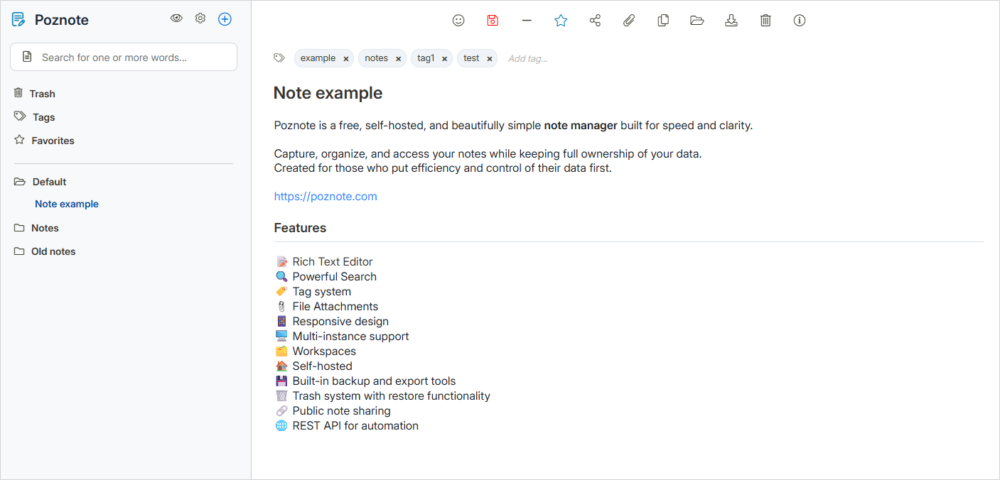

<!-- generated -->

# Poznote

1-Click installation template for Poznote on Easypanel

## Description

Poznote is a lightweight, self-hosted note-taking application designed for personal knowledge management and quick note capture. It provides a simple, clean interface for creating, organizing, and managing notes without unnecessary complexity. Poznote uses SQLite for data storage, making it easy to deploy without requiring external database setup. The application features secure authentication, markdown support, and fast search capabilities to help you find information quickly. All your notes are stored locally in a SQLite database file, ensuring privacy and complete control over your data. Perfect for individuals who want a straightforward, fast, and private note-taking solution that can be accessed from any browser.

## Benefits

- Simple & Fast: Minimalist interface focused on quick note capture and retrieval. No bloat, just the essentials you need for effective note-taking.
- Self-Hosted Privacy: All notes stored locally in SQLite database on your server. Your thoughts and ideas remain completely private and under your control.
- Zero Database Setup: Uses SQLite for storage - no external database configuration required. Simple deployment with everything contained in one application.

## Features

- Quick Note Capture: Create and edit notes quickly with a clean, distraction-free interface designed for fast note-taking.
- Secure Authentication: Password-protected access ensures only authorized users can view and manage your notes.
- SQLite Storage: Reliable, lightweight SQLite database stores all your notes efficiently without requiring external database servers.
- Search Functionality: Quickly find notes with built-in search capabilities to locate information when you need it.
- Markdown Support: Write notes in markdown format for structured, formatted content that's easy to read and portable.
- Web-Based Access: Access your notes from any device with a web browser - no desktop app installation required.

## Links

- [Website](https://poznote.com)
- [Documentation](https://github.com/timothepoznanski/poznote?tab=readme-ov-file#table-of-content)
- [Github](https://github.com/TimothePoznanski/poznote)
- [Template Source](https://github.com/easypanel-io/templates/tree/main/templates/poznote)

## Options

Name | Description | Required | Default Value
-|-|-|-
App Service Name | - | yes | poznote
App Service Image | - | yes | ghcr.io/timothepoznanski/poznote:1.9.0
Username | - | yes | admin
Password | - | yes | 

## Screenshots

## Change Log

- 2025-11-18 – Template Release

## Contributors

- [Ahson Shaikh](https://github.com/Ahson-Shaikh)
