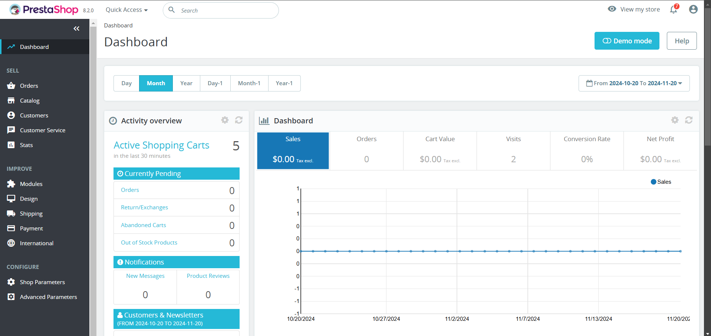

<!-- generated -->

# Prestashop

1-Click installation template for Prestashop on Easypanel

## Description

Prestashop is an open-source e-commerce platform that empowers businesses to build and manage their online stores. It provides a user-friendly interface, a robust product catalog system, order management, and customizable themes, making it an ideal choice for merchants of all sizes. Prestashop supports multiple payment gateways, multilingual and multi-currency features, and SEO optimization to ensure a global reach and enhanced online visibility. Additionally, it offers a vibrant marketplace for modules and themes, enabling seamless customization and integration with third-party services.

## Instructions

Configure the database during the installation wizard. Use the provided domains for the admin panel and storefront setup.

## Benefits

- Comprehensive E-commerce Solution: Prestashop provides all the tools needed to launch and manage a successful online store, including product catalog management, payment integration, and order processing.
- Customizable Themes and Modules: Choose from a wide variety of themes and modules available in the Prestashop marketplace to create a unique shopping experience tailored to your brand.
- Multilingual and Multi-currency Support: Expand your business globally with built-in support for multiple languages and currencies, ensuring a seamless shopping experience for customers worldwide.
- SEO-Friendly: Prestashop includes built-in SEO optimization tools to improve your store's visibility on search engines and attract more customers.
- Active Community: Join a vibrant community of developers, merchants, and contributors who provide ongoing support and innovation for the Prestashop ecosystem.

## Features

- Product Catalog Management: Organize and display products with categories, attributes, and variations, providing customers with detailed and engaging product listings.
- Secure Payment Integration: Prestashop supports multiple secure payment gateways, allowing customers to complete transactions safely and conveniently.
- Analytics and Reporting: Gain insights into your store's performance with built-in analytics and reporting tools, helping you make informed business decisions.
- Mobile-Responsive Design: Ensure an optimized shopping experience across devices with mobile-responsive themes and layouts.
- Open Source: Prestashop is open-source, providing full control and flexibility to customize your store according to your specific needs.

## Links

- [Website](https://www.prestashop.com)
- [Documentation](https://devdocs.prestashop.com)
- [Github](https://github.com/PrestaShop/PrestaShop)
- [Template Source](https://github.com/easypanel-io/templates/tree/main/templates/prestashop)

## Options

Name | Description | Required | Default Value
-|-|-|-
App Service Name | - | yes | prestashop
App Service Image | - | yes | prestashop/prestashop:8.2.0

## Screenshots

## Change Log

- 2024-11-20 – First Release

## Contributors

- [Ahson Shaikh](https://github.com/Ahson-Shaikh)
