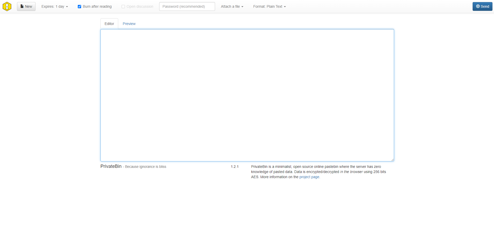

<!-- generated -->

# PrivateBin

1-Click installation template for PrivateBin on Easypanel

## Description

PrivateBin is a minimalist, open-source, self-hosted pastebin solution designed for secure and private data sharing. It features end-to-end encryption, ensuring that your shared content remains confidential. With its simple interface and focus on privacy, PrivateBin is an excellent tool for individuals and teams who value secure communication.

## Benefits

- Secure Data Sharing: Share sensitive information confidently with built-in end-to-end encryption.
- Self-Hosted Solution: Maintain full control over your data with a self-hosted setup.
- Minimalist Design: Enjoy a clean and simple interface for effortless usage.

## Features

- End-to-End Encryption: Content is encrypted before it reaches the server, ensuring privacy.
- Expiry Options: Set expiration times for shared content to control its availability.
- Self-Destructing Pastes: Enable automatic deletion after the first view for sensitive data.
- No Metadata Storage: PrivateBin does not store metadata, enhancing user privacy.

## Links

- [Website](https://privatebin.info/)
- [Github](https://github.com/PrivateBin/PrivateBin)
- [Template Source](https://github.com/easypanel-io/templates/tree/main/templates/privatebin)

## Options

Name | Description | Required | Default Value
-|-|-|-
App Service Name | - | yes | privatebin
App Service Image | - | yes | privatebin/nginx-fpm-alpine:1.2.1

## Screenshots

## Change Log

- 2024-11-27 – Template Release

## Contributors

- [Ahson Shaikh](https://github.com/Ahson-Shaikh)
