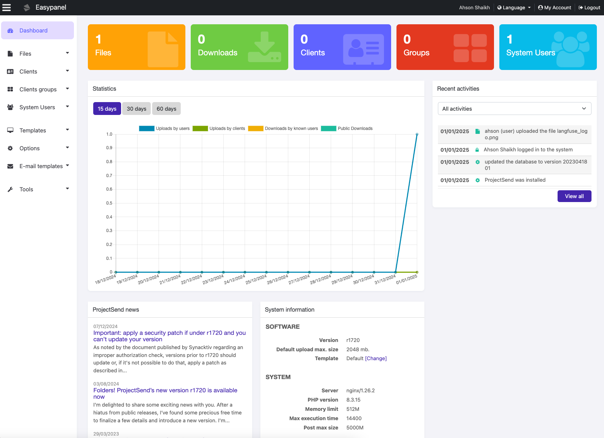

<!-- generated -->

# ProjectSend

1-Click installation template for ProjectSend on Easypanel

## Description

ProjectSend is a self-hosted file sharing platform designed to securely share files with clients and collaborators. It provides a user-friendly interface, supports advanced user management, and allows for detailed activity tracking. With ProjectSend, you can maintain control over your files and ensure secure access for authorized users.

## Instructions

After Connecting with the DB, configure the URL to be https in next screen of installation wizard and run chmod 755 /app/www/public/emails in the terminal after the installation.

## Benefits

- Secure File Sharing: ProjectSend allows you to securely upload and share files with clients and collaborators through a centralized platform.
- Self-Hosted Solution: Stay in control of your files with a self-hosted service, ensuring privacy and flexibility.
- Advanced User Management: Manage user roles, permissions, and access levels for better security and organization.

## Features

- Custom User Roles: Assign specific roles and permissions to users for tailored access control.
- File Management: Organize and categorize files with ease, supporting efficient retrieval and collaboration.
- Activity Tracking: Monitor user activity and file access with detailed logs for accountability.
- Multi-Language Support: Access the platform in multiple languages to cater to diverse user bases.

## Links

- [Website](https://www.projectsend.org/)
- [Github](https://github.com/projectsend/projectsend)
- [Template Source](https://github.com/easypanel-io/templates/tree/main/templates/projectsend)

## Options

Name | Description | Required | Default Value
-|-|-|-
App Service Name | - | yes | projectsend
App Service Image | - | yes | lscr.io/linuxserver/projectsend:version-r1720

## Screenshots

## Change Log

- 2025-02-14 – Template Release

## Contributors

- [Ahson Shaikh](https://github.com/Ahson-Shaikh)
