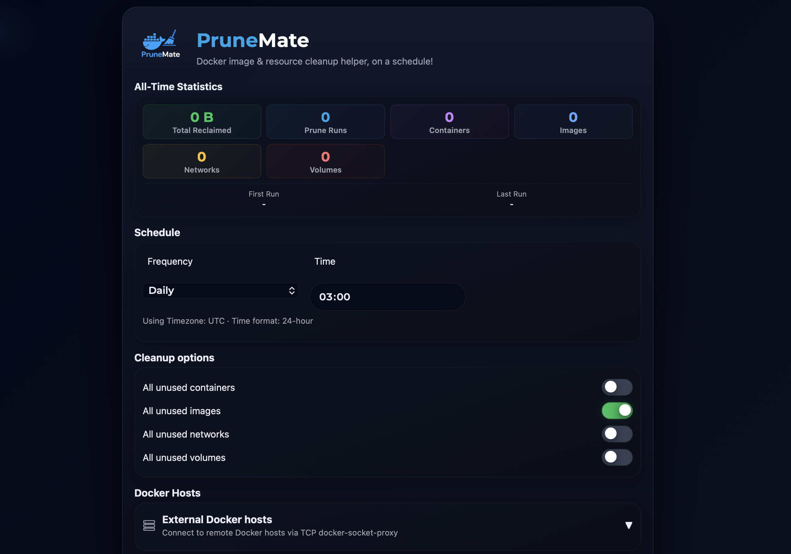

<!-- generated -->

# PruneMate

1-Click installation template for PruneMate on Easypanel

## Description

PruneMate is a self-hosted Docker cleanup and management tool that provides a web-based interface for pruning unused Docker resources from your system. It helps you reclaim disk space by identifying and removing unused containers, images, volumes, networks, and build cache. With its intuitive dashboard, you can easily monitor Docker resource usage, schedule automatic cleanup tasks, and manually trigger pruning operations without using command-line tools. PruneMate connects directly to your Docker daemon via the Docker socket, allowing it to safely analyze and clean up orphaned resources that accumulate over time. The application features configurable cleanup schedules, selective pruning options to choose which resource types to clean, detailed logging of all cleanup operations, and real-time statistics showing disk space recovered. With timezone support and customizable time format settings, you can schedule cleanup operations to run during off-peak hours. Perfect for developers and system administrators who manage Docker environments and want to automate the cleanup of unused resources, homelab enthusiasts running multiple containers who need to manage disk space efficiently, CI/CD environments where frequent image builds create significant cleanup overhead, or anyone looking for a simple web interface to manage Docker resource cleanup without remembering complex docker system prune commands.

## Benefits

- Automated Docker Cleanup: Automatically prune unused Docker resources on a schedule to keep your system clean and disk space optimized without manual intervention.
- Visual Resource Management: Web-based dashboard provides clear visibility into Docker resource usage and makes cleanup operations simple and intuitive.
- Disk Space Recovery: Reclaim valuable disk space by removing unused containers, images, volumes, networks, and build cache that accumulate over time.
- Safe Pruning Operations: Intelligently identifies truly unused resources to safely clean up without affecting running containers or important data.

## Features

- Web-Based Dashboard: Intuitive web interface for monitoring Docker resources and triggering cleanup operations without command-line access.
- Scheduled Cleanup: Configure automatic cleanup schedules to run pruning operations during off-peak hours for minimal disruption.
- Selective Pruning: Choose which Docker resource types to clean including containers, images, volumes, networks, and build cache.
- Resource Statistics: Real-time statistics showing current resource usage and disk space that can be recovered through cleanup.
- Cleanup Logging: Detailed logs of all cleanup operations showing what was removed and how much space was recovered.
- Timezone Support: Configure your local timezone for accurate scheduling and logging of cleanup operations.
- Time Format Options: Choose between 12-hour and 24-hour time format display based on your preference.
- Docker Socket Integration: Direct integration with Docker daemon via socket for reliable and secure container and resource management.

## Links

- [Website](https://prunemate.org)
- [Github](https://github.com/anoniemerd/PruneMate)
- [Documentation](https://prunemate.org/documentation.html)
- [Template Source](https://github.com/easypanel-io/templates/tree/main/templates/prunemate)

## Options

Name | Description | Required | Default Value
-|-|-|-
App Service Name | - | yes | prunemate
App Service Image | - | yes | anoniemerd/prunemate:1.3.3
Timezone | - | no | UTC
Use 24-Hour Time Format | - | no | true

## Screenshots

## Change Log

- 2025-12-02 – Template Release

## Contributors

- [Ahson Shaikh](https://github.com/Ahson-Shaikh)
