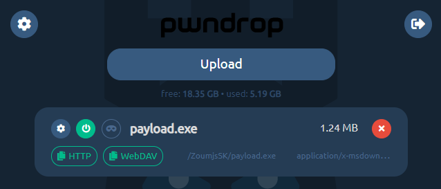

<!-- generated -->

# Pwndrop

1-Click installation template for Pwndrop on Easypanel

## Description

Pwndrop is a self-deployable file hosting service for red teamers, designed for sending payloads and collecting loot in penetration testing operations. It provides a lightweight, standalone solution for hosting and managing files during security assessments. With its simple web interface, you can easily upload, organize, and share files with customizable download links. Pwndrop offers features like file tracking, download notifications, and an admin portal protected by a secret path for enhanced security.

## Instructions

After deployment, user will be redirected to create an account.

## Benefits

- Self-Deployable File Hosting: Quick and easy deployment of a file hosting service with minimal configuration required, perfect for temporary file sharing needs.
- Lightweight Solution: Resource-efficient application that can run on minimal infrastructure without complex dependencies or heavy resource requirements.
- Secure Admin Access: Protected admin interface accessible through a customizable secret path, preventing unauthorized access to administrative functions.
- File Management: Simple web-based interface for uploading, organizing, and managing files with easy-to-generate shareable download links.

## Features

- Easy File Upload: Intuitive web interface for quick file uploads and organization with support for managing multiple files simultaneously.
- Customizable Links: Generate custom download links with configurable parameters for better tracking and control over file distribution.
- Download Tracking: Monitor file downloads with detailed tracking information to know when and how files are being accessed.
- Secret Admin Portal: Access administrative functions through a configurable secret path that hides the admin interface from unauthorized users.
- Standalone Deployment: Self-contained application that doesn't require external dependencies, making it easy to deploy in various environments.
- Minimal Configuration: Get started quickly with minimal setup required - just deploy and start sharing files immediately.

## Links

- [Website](https://breakdev.org/pwndrop/)
- [GitHub](https://github.com/kgretzky/pwndrop)
- [Documentation](https://breakdev.org/pwndrop/)
- [Template Source](https://github.com/easypanel-io/templates/tree/main/templates/pwndrop)

## Options

Name | Description | Required | Default Value
-|-|-|-
App Service Name | - | yes | pwndrop
App Service Image | Pwndrop Docker image from LinuxServer.io | yes | lscr.io/linuxserver/pwndrop:1.0.1

## Screenshots

## Change Log

- 2025-10-21 – Initial Template Release (v1.0.1)

## Contributors

- [Ahson Shaikh](https://github.com/Ahson-Shaikh)
