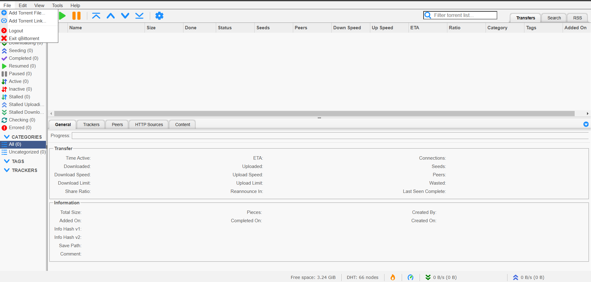

<!-- generated -->

# qBittorrent

1-Click installation template for qBittorrent on Easypanel

## Description

qBittorrent is a powerful, open-source BitTorrent client designed to provide an efficient and feature-rich experience for downloading and sharing files. It offers a user-friendly interface, robust functionality, and cross-platform compatibility. qBittorrent supports advanced features like sequential downloading, IP filtering, RSS feed support, and a built-in search engine for finding torrents. It also includes a web-based interface for managing downloads remotely. Designed to balance performance, simplicity, and advanced capabilities, qBittorrent is ideal for users seeking a secure and reliable torrenting solution.

## Instructions

Username is admin, password is provided in the overview logs.

## Benefits

- User-Friendly Interface: qBittorrent offers an intuitive interface that simplifies downloading, sharing, and managing torrents.
- Advanced Features: Enjoy features like sequential downloading, IP filtering, RSS feed support, and an integrated torrent search engine.
- Cross-Platform Support: qBittorrent runs on major operating systems, including Windows, macOS, and Linux, ensuring compatibility across devices.
- Remote Management: Manage torrents remotely with qBittorrent's powerful web-based interface, providing flexibility and convenience.
- Open-Source and Secure: Benefit from a secure, community-driven, open-source application with no ads or hidden costs.

## Features

- Integrated Torrent Search: Search for torrents directly within qBittorrent without relying on external websites.
- RSS Feed Support: Automatically download torrents from your favorite RSS feeds.
- Web-Based UI: Manage torrents from anywhere using the secure and intuitive web-based interface.
- Sequential Downloading: Download files in sequential order, allowing you to preview media files as they are downloaded.
- IP Filtering and Encryption: Enhance security with IP filtering and protocol encryption to safeguard your downloads.

## Links

- [Website](https://www.qbittorrent.org)
- [Docs](https://github.com/qbittorrent/qBittorrent/wiki)
- [Github](https://github.com/qbittorrent/qBittorrent)
- [Template Source](https://github.com/easypanel-io/templates/tree/main/templates/qbitorrent)

## Options

Name | Description | Required | Default Value
-|-|-|-
App Service Name | - | yes | qbittorrent
App Service Image | - | yes | lscr.io/linuxserver/qbittorrent:4.6.7
Torrenting Port | - | yes | 6881

## Screenshots

## Change Log

- 2024-11-16 – First Release

## Contributors

- [Ahson Shaikh](https://github.com/Ahson-Shaikh)
