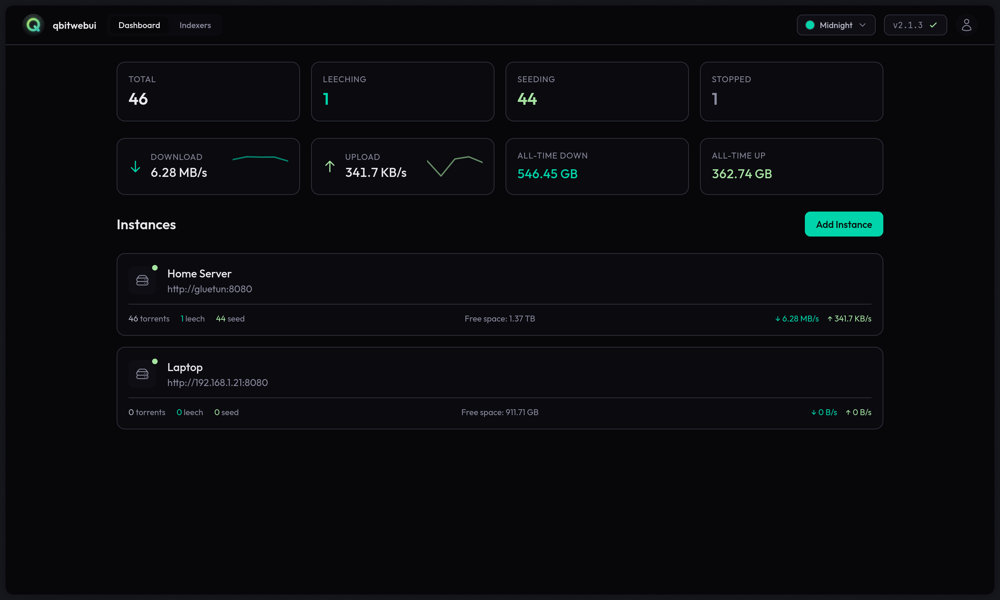

<!-- generated -->

# qBitWebUI

1-Click installation template for qBitWebUI on Easypanel

## Description

qBitWebUI is a modern web interface for qBittorrent, providing an enhanced user experience for managing your torrent downloads. It offers a clean, responsive design with advanced features like dark mode, mobile support, and improved usability compared to the default qBittorrent web UI. Perfect for users who want a better way to manage their torrents remotely through a web browser.

## Benefits

- Modern Web Interface: Enjoy a clean, modern web interface for qBittorrent with improved usability and better user experience.
- Enhanced Features: Access advanced features like dark mode, mobile support, and improved torrent management capabilities.
- Remote Access: Manage your torrents from anywhere through a web browser with secure encryption.
- Self-Hosted Control: Deploy on your own infrastructure for complete control over your torrent management interface.

## Features

- Responsive Design: Works seamlessly on desktop, tablet, and mobile devices with a responsive layout.
- Dark Mode Support: Built-in dark mode for comfortable viewing in low-light conditions.
- Secure Encryption: Encrypted data storage with auto-generated encryption keys for enhanced security.
- Easy Configuration: Simple setup process with minimal configuration required to get started.
- qBittorrent Integration: Seamlessly connects to your existing qBittorrent instance for complete torrent management.

## Links

- [GitHub](https://github.com/maciejonos/qbitwebui)
- [Website](https://maciejonos.github.io/qbitwebui/)
- [Template Source](https://github.com/easypanel-io/templates/tree/main/templates/qbitwebui)

## Options

Name | Description | Required | Default Value
-|-|-|-
App Service Name | - | yes | qbitwebui
App Service Image | - | yes | ghcr.io/maciejonos/qbitwebui:2.21

## Screenshots

## Change Log

- 2026-01-09 – Template Release

## Contributors

- [Ahson Shaikh](https://github.com/Ahson-Shaikh)
