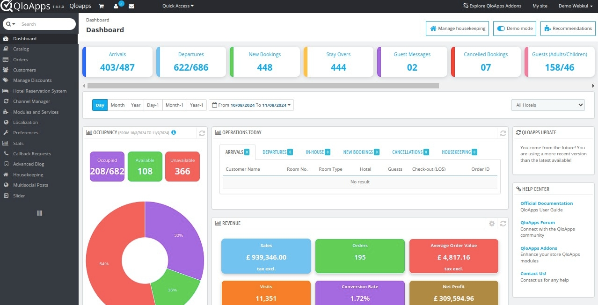

<!-- generated -->

# QloApps

1-Click installation template for QloApps on Easypanel

## Description

QloApps is a comprehensive hotel booking and property management system built on PrestaShop. It provides a complete solution for hoteliers to manage their properties, bookings, and customers. The system includes features like room management, booking engine, customer management, and payment processing. QloApps is designed to help hotels streamline their operations and improve guest experience.

## Instructions

Login email admin@qloapps.local and password 12345678

## Benefits

- Complete Hotel Management: Manage all aspects of your hotel business from a single platform.
- Booking Engine: Powerful booking engine with real-time availability and pricing.
- Customer Management: Comprehensive customer profiles and booking history.
- Payment Processing: Integrated payment processing with multiple payment gateways.
- Mobile Responsive: Mobile-friendly interface for both guests and staff.

## Features

- Room Management: Manage room types, rates, and availability with ease.
- Booking Management: Handle reservations, check-ins, and check-outs efficiently.
- Customer Portal: Self-service portal for guests to manage their bookings.
- Reporting: Generate detailed reports on occupancy, revenue, and more.
- Multi-language Support: Support for multiple languages to serve international guests.

## Links

- [Website](https://qloapps.com/)
- [Documentation](https://qloapps.com/hotel-website/)
- [Github](https://github.com/Qloapps/QloApps)
- [Template Source](https://github.com/easypanel-io/templates/tree/main/templates/qloapps)

## Options

Name | Description | Required | Default Value
-|-|-|-
App Service Name | - | yes | qloapps
App Service Image | - | yes | webkul/qloapps_docker:1.6.1

## Screenshots

## Change Log

- 2025-04-07 – First Release
- 2026-05-08 – Version bumped to 1.6.1

## Contributors

- [Ahson Shaikh](https://github.com/Ahson-Shaikh)
