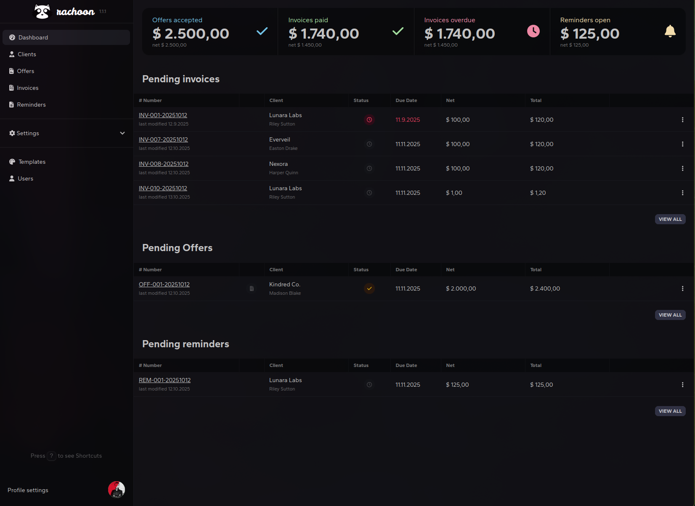

<!-- generated -->

# Rachoon

1-Click installation template for Rachoon on Easypanel

## Description

Rachoon is a self-hosted invoicing platform for creating and tracking invoices, managing clients, and exporting professional PDFs. This template deploys Rachoon with PostgreSQL and Gotenberg as required dependencies.

## Instructions

After deployment, open your domain and create your account in the Rachoon UI. The APP_KEY is generated automatically unless you provide one. Database values are wired automatically to the bundled PostgreSQL service.

## Benefits

- End-to-end invoicing stack: Deploy invoice management app, PDF generation service, and database together.
- Self-hosted billing data: Keep invoice and customer data on infrastructure you control.
- Ready for PDF workflows: Includes Gotenberg integration used by Rachoon for document rendering.

## Features

- Invoice and client management: Create, manage, and track invoices and client records from one UI.
- PDF export support: Built-in Gotenberg service enables invoice PDF generation.
- Persistent PostgreSQL storage: Data is stored in the PostgreSQL service volume for durability.

## Links

- [Documentation](https://github.com/ad-on-is/rachoon#readme)
- [GitHub](https://github.com/ad-on-is/rachoon)
- [Container registry](https://github.com/ad-on-is/rachoon/pkgs/container/rachoon)
- [Template Source](https://github.com/easypanel-io/templates/tree/main/templates/rachoon)

## Options

Name | Description | Required | Default Value
-|-|-|-
App Service Name | - | yes | rachoon
Rachoon Image | - | yes | ghcr.io/ad-on-is/rachoon:v1.3.7
Gotenberg Image | - | yes | gotenberg/gotenberg:8.30.1
APP_KEY (optional) | Leave empty to auto-generate a secure key | no | 

## Screenshots

## Change Log

- 2026-04-07 – Initial template release

## Contributors

- [Ahson Shaikh](https://github.com/Ahson-Shaikh)
