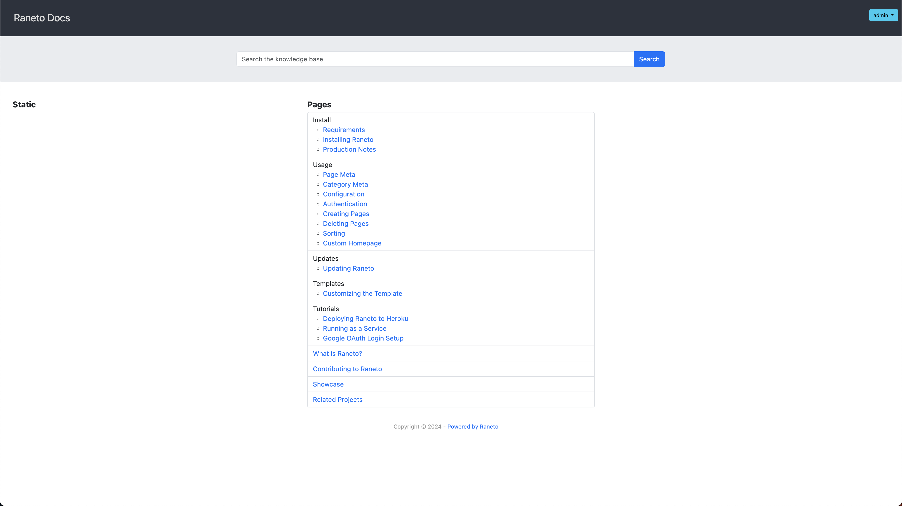

<!-- generated -->

# Raneto

1-Click installation template for Raneto on Easypanel

## Description

Raneto is an open source Knowledgebase platform that uses static Markdown files to power your Knowledgebase.

## Links

- [Website](https://raneto.com)
- [Documentation](https://docs.linuxserver.io/images/docker-raneto)
- [Github](https://github.com/linuxserver/docker-raneto)
- [Template Source](https://github.com/easypanel-io/templates/tree/main/templates/raneto)

## Options

Name | Description | Required | Default Value
-|-|-|-
App Service Name | - | yes | raneto
App Service Image | - | yes | lscr.io/linuxserver/raneto:0.17.8
Timezone | - | no | Etc/UTC

## Screenshots

## Change Log

- 2022-11-27 – first release

## Contributors

- [Serban Alexandru](https://github.com/serban-alexandru)
