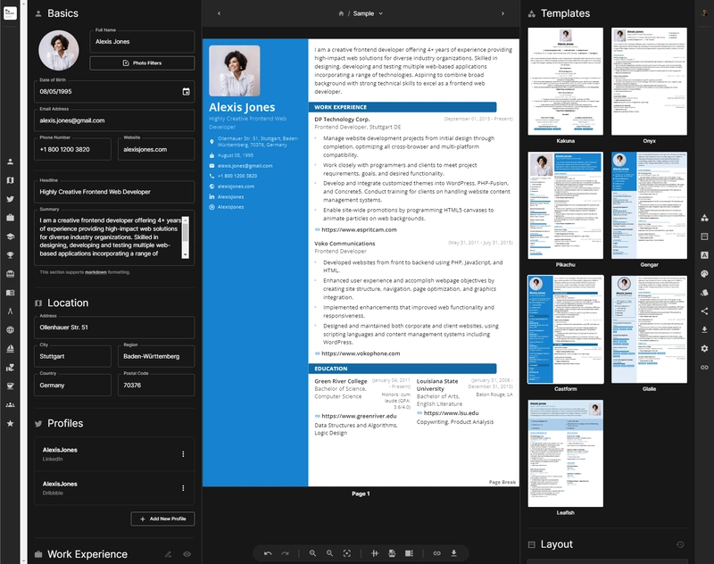

<!-- generated -->

# Reactive Resume

1-Click installation template for Reactive Resume on Easypanel

## Description

Reactive Resume is a free and open-source resume builder that simplifies the process of creating, updating, and sharing your resume. With zero user tracking or advertising, your privacy is a top priority. The platform is extremely user-friendly and can be self-hosted in less than 30 seconds if you wish to own your data completely. It&#39;s available in multiple languages and comes packed with features such as real-time editing, dozens of templates, drag-and-drop customisation, and integration with OpenAI for enhancing your writing. You can share a personalised link of your resume to potential employers, track its views or downloads, and customise your page layout by dragging-and-dropping sections.

## Instructions

Deploy the stack and open the app on your domain then create the first account and start building resumes, this template uses the Reactive Resume v4.4.5 legacy compatible environment schema with PostgreSQL printer.

## Benefits

- Privacy-First Design: No user tracking, no analytics, no advertising. Your data stays on your server and under your complete control.
- Professional Templates: Choose from dozens of professionally designed templates ranging from traditional to modern styles, all fully customizable.
- AI-Powered Features: Integrate with OpenAI to improve your writing, fix grammar, change tone, and even translate your resume into different languages.

## Features

- Drag & Drop Builder: Intuitive drag-and-drop interface to customize your resume layout, reorder sections, and create custom sections specific to your industry.
- Real-time Collaboration: Share personalized links with potential employers, track views and downloads, and make real-time updates that are instantly available.
- Multi-format Export: Export your resume as PDF in A4 or Letter format, or save as JSON for easy backup and portability between instances.
- Multi-language Support: Available in multiple languages with full internationalization support, and use AI to translate your resume content.

## Links

- [Website](https://rxresu.me/)
- [Documentation](https://docs.rxresume.org/self-hosting/docker)
- [GitHub](https://github.com/AmruthPillai/Reactive-Resume)
- [Demo](https://rxresu.me/)
- [Template Source](https://github.com/easypanel-io/templates/tree/main/templates/reactive-resume)

## Options

Name | Description | Required | Default Value
-|-|-|-
App Service Name | - | yes | reactive-resume
App Service Image | Image for the app service | yes | amruthpillai/reactive-resume:v4.4.5
MinIO Service Image | Image for the internal MinIO storage service | yes | minio/minio:RELEASE.2025-09-07T16-13-09Z
Disable Public Signups | Prevent new users from registering accounts | no | false
Disable Email Authentication | Disable email/password authentication (OAuth only) | no | false

## Screenshots

## Change Log

- 2026-04-01 – Initial release

## Contributors

- [Ahson Shaikh](https://github.com/Ahson-Shaikh)
