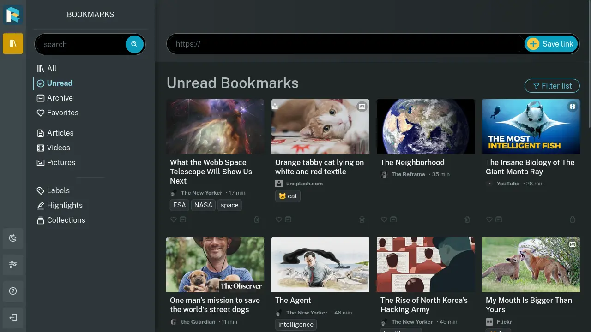

<!-- generated -->

# Readeck

1-Click installation template for Readeck on Easypanel

## Description

Readeck is a self-hosted read-it-later service that allows you to save articles, web pages, and other content for later reading. It provides a clean and distraction-free reading experience with features for organizing and managing your saved content.

## Instructions

After installation, access the web interface through the provided domain to start saving and organizing your reading list.

## Benefits

- Self-Hosted: Keep control of your reading list with your own instance.
- Clean Interface: Enjoy a distraction-free reading experience.
- Content Management: Organize and manage your saved articles efficiently.
- Easy Saving: Quickly save articles for later reading.
- Privacy Focused: Your reading data stays on your own server.

## Features

- Article Storage: Save articles and web pages for later reading.
- Content Organization: Organize content with tags and categories.
- Reading Mode: Clean, distraction-free reading interface.
- Data Control: Full control over your reading data.
- Web Interface: Access your reading list through a modern web interface.

## Links

- [Codeberg](https://codeberg.org/readeck/readeck)
- [Website](https://readeck.org)
- [Documentation](https://readeck.org/en/docs/)
- [Template Source](https://github.com/easypanel-io/templates/tree/main/templates/readeck)

## Options

Name | Description | Required | Default Value
-|-|-|-
App Service Name | - | yes | readeck
App Service Image | - | yes | codeberg.org/readeck/readeck:latest

## Screenshots

## Change Log

- 2024-04-09 – First Release

## Contributors

- [Ahson Shaikh](https://github.com/Ahson-Shaikh)
