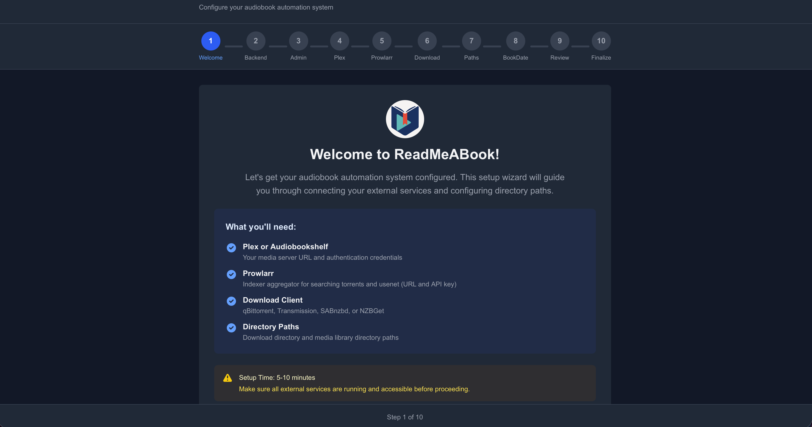

<!-- generated -->

# ReadMeABook

1-Click installation template for ReadMeABook on Easypanel

## Description

ReadMeABook is a self-hosted audiobook request and automation platform—like Radarr/Sonarr + Overseerr for audiobooks. Integrates with Plex or Audiobookshelf, supports torrents (qBittorrent) and Usenet (SABnzbd), Prowlarr for search. Features multi-file chapter merging, e-book sidecars, AI recommendations (BookDate), and admin approval workflows. Includes PostgreSQL and Redis.

## Instructions

After deployment, access the web UI and run the setup wizard. Set PUBLIC_URL to your domain (e.g. `https://readmeabook.yourdomain.com`) for OAuth (Plex/OIDC). Mount downloads and media volumes for audiobook storage. Connect to Plex or Audiobookshelf, and configure qBittorrent/SABnzbd for downloads.

## Benefits

- Audiobook Automation: Request, search, download, and organize audiobooks automatically
- Plex & Audiobookshelf: Integrates with popular media servers
- All-in-One: PostgreSQL and Redis included; no external database required
- Self-Hosted: Full control over your audiobook library

## Features

- Torrent & Usenet: qBittorrent and SABnzbd support
- Prowlarr Integration: Search across indexers via Prowlarr
- AI Recommendations: BookDate with Tinder-style swipe (OpenAI, Claude, local models)
- Multi-User & Admin: Request approval workflows
- Chapter Merging: Multi-file chapter merging, e-book sidecar (EPUB/PDF)

## Links

- [GitHub](https://github.com/kikootwo/readmeabook)
- [Documentation](https://github.com/kikootwo/readmeabook/tree/main/documentation)
- [Template Source](https://github.com/easypanel-io/templates/tree/main/templates/readmeabook)

## Options

Name | Description | Required | Default Value
-|-|-|-
App Service Name | - | yes | readmeabook
App Service Image | - | yes | ghcr.io/kikootwo/readmeabook:1.1.8
User ID (PUID) | Host user ID for file ownership | no | 1000
Group ID (PGID) | Host group ID for file ownership | no | 1000
Public URL | Required for OAuth. e.g. https://readmeabook.yourdomain.com | no | 

## Screenshots

## Change Log

- 2026-02-09 – First Release
- 2026-03-25 – Version bumped to 1.1.7.
- 2026-05-05 – Version bumped to 1.1.8

## Contributors

- [Ahson Shaikh](https://github.com/Ahson-Shaikh)
