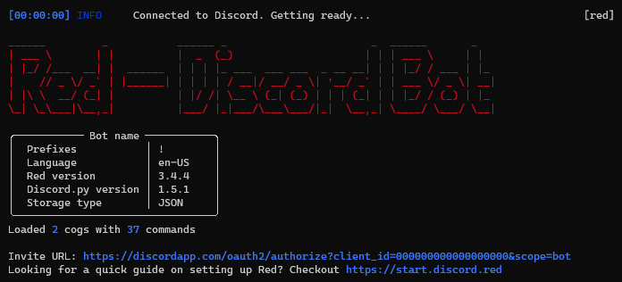

<!-- generated -->

# Red-DiscordBot

1-Click installation template for Red-DiscordBot on Easypanel

## Description

Red-DiscordBot is a fully modular bot for Discord, designed to be easy to use and highly customizable. It features a robust command system, extensive documentation, and a large collection of community-created cogs (modules). The bot supports features like moderation, music playback, games, utility functions, and much more. With its modular design, users can easily add or remove functionality by loading and unloading cogs, making it perfect for both small and large Discord communities.

## Benefits

- Modular Design: Easily customize your bot by adding or removing cogs (modules) to suit your server's needs.
- Extensive Feature Set: Access a wide range of features including moderation, music, games, and utility functions.
- Active Community: Benefit from regular updates, community support, and a vast collection of user-created cogs.

## Features

- Command System: Create and manage custom commands with ease using Red's intuitive command system.
- Cog Management: Load, unload, and reload cogs without restarting the bot for seamless updates.
- Data Storage: Built-in data storage system for saving settings, user data, and custom configurations.
- Event System: Respond to Discord events and create custom event handlers for advanced functionality.

## Links

- [GitHub](https://github.com/Cog-Creators/Red-DiscordBot)
- [Documentation](https://docs.discord.red/)
- [Docker Hub](https://hub.docker.com/r/phasecorex/red-discordbot)
- [Template Source](https://github.com/easypanel-io/templates/tree/main/templates/red-discordbot)

## Options

Name | Description | Required | Default Value
-|-|-|-
App Service Name | - | yes | red-discordbot
Red-DiscordBot Image | - | yes | phasecorex/red-discordbot:audio-py311
Discord Bot Token | Your Discord bot token from the Discord Developer Portal | yes | 
Timezone | The timezone for your Discord server. | yes | America/Detroit
Discord Command Prefix | - | yes | .

## Screenshots

## Change Log

- 2025-03-2 – Initial template release

## Contributors

- [Ahson Shaikh](https://github.com/Ahson-Shaikh)
