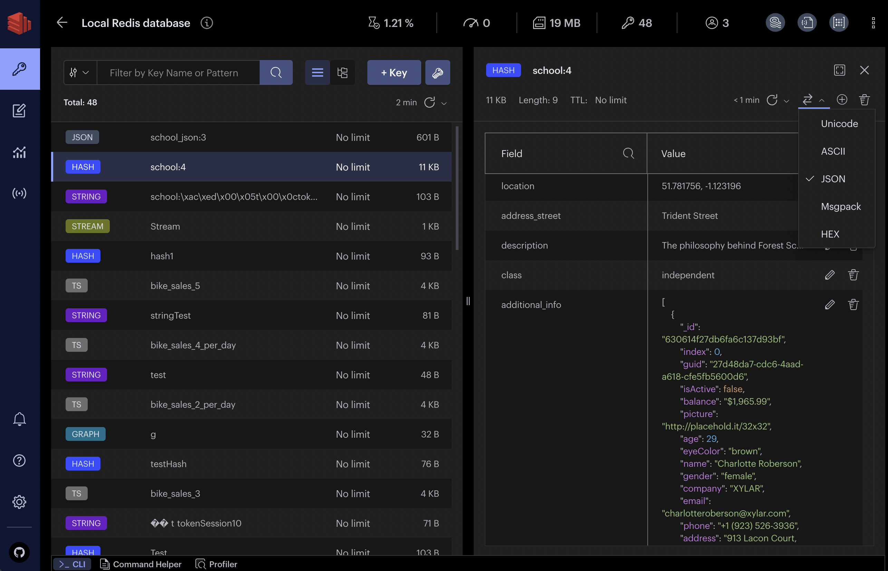

<!-- generated -->

# Redis Insight

1-Click installation template for Redis Insight on Easypanel

## Description

Redis Insight is an ideal tool for developers who build with any Redis deployments and who want to optimize their development process. Redis Insight lets you visually browse and interact with data, take advantage of the advanced command line interface and diagnostic tools, and so much more.

## Benefits

- Visual Data Exploration: Easily browse, query, and manage Redis data structures through an intuitive graphical interface.
- Faster Development: Debug, test, and optimize Redis queries and workflows more efficiently with built-in tools.
- Enhanced Productivity: Gain insights into memory usage, performance, and data patterns to build scalable applications.

## Features

- Visual Browser: Navigate and manage keys, streams, hashes, sets, and other Redis data types interactively.
- Advanced CLI: Run Redis commands with autocomplete, syntax highlighting, and history support.
- Performance Insights: Analyze memory usage, latency, and command performance for optimization.
- Data Visualization: View data trends, charts, and statistics directly from your Redis instance.
- Multi-Deployment Support: Connect to multiple Redis servers, including standalone, clustered, and cloud-managed instances.

## Links

- [Website](https://redis.io/insight)
- [Docker Hub](https://hub.docker.com/r/redis/redisinsight)
- [Configuration](https://redis.io/docs/latest/operate/redisinsight/configuration)
- [Template Source](https://github.com/easypanel-io/templates/tree/main/templates/redisinsight)

## Options

Name | Description | Required | Default Value
-|-|-|-
App Service Name | - | yes | redisinsight
App Service Image | - | yes | redis/redisinsight:2.70.1

## Screenshots

## Change Log

- 2025-09-23 – Template Release

## Contributors

- [Leonardo Gomide](https://github.com/leogomide)
