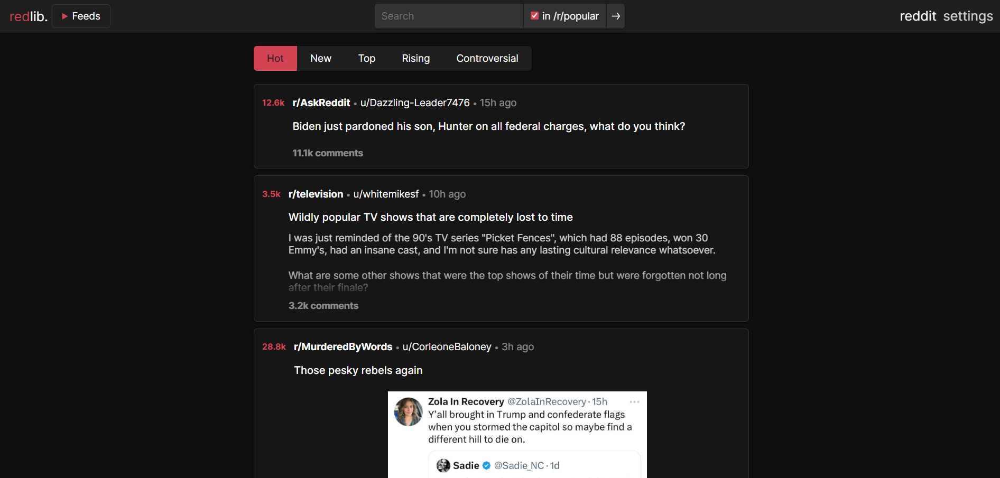

<!-- generated -->

# Redlib

1-Click installation template for Redlib on Easypanel

## Description

Redlib is a privacy-focused and lightweight alternative frontend for Reddit, designed to enhance user experience by removing ads, tracking, and unnecessary JavaScript. Built using Rust, Redlib delivers a fast and efficient browsing experience while ensuring user privacy by proxying all requests, including media, through its server. It provides an ad-free, clutter-free interface inspired by Reddit&#39;s modern design, making it an ideal choice for users seeking a secure and streamlined way to browse Reddit content.

## Benefits

- Enhanced Privacy: Redlib proxies all requests through its server, including media, preventing Reddit from directly tracking users or accessing their information.
- Lightweight and Fast: Built with Rust, Redlib offers a fast browsing experience with minimal resource usage, free from JavaScript or bloated elements.
- Customizable Settings: Users can adjust settings like themes, default sorting, and display options through an intuitive interface, with preferences stored securely in cookies.

## Features

- No Ads or Tracking: Browse Reddit without interruptions or intrusive tracking, enjoying a clean and distraction-free interface.
- Proxy-Based Privacy: All requests, including media, are proxied through Redlib’s server to ensure user anonymity and secure content delivery.
- Rust-Powered Efficiency: Built in Rust for optimal performance, offering a robust and secure backend to handle high traffic with ease.
- Multi-Platform Deployment: Redlib supports deployment on Docker, Podman, and other container platforms, with pre-built images for major architectures like amd64, arm64, and armv7.
- Open Source and Community-Driven: Fully open-source and actively maintained by a global community, enabling users to contribute to its growth and development.

## Links

- [Website](https://github.com/redlib-org/redlib)
- [Documentation](https://github.com/redlib-org/redlib#readme)
- [Public Instances](https://github.com/redlib-org/redlib-instances)
- [Template Source](https://github.com/easypanel-io/templates/tree/main/templates/redlib)

## Options

Name | Description | Required | Default Value
-|-|-|-
App Service Name | - | yes | redlib
App Service Image | - | yes | quay.io/redlib/redlib:sha-00dee52

## Screenshots

## Change Log

- 2024-12-02 – Template added

## Contributors

- [Ahson Shaikh](https://github.com/Ahson-Shaikh)
