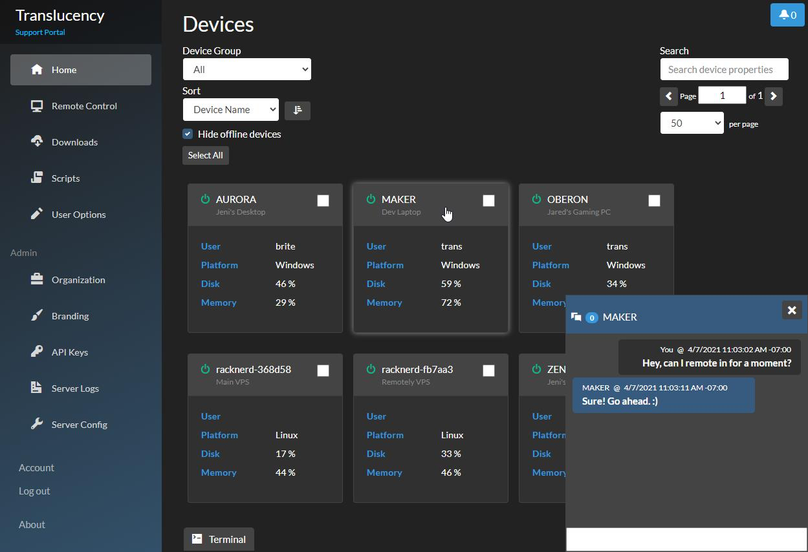

<!-- generated -->

# Remotely

1-Click installation template for Remotely on Easypanel

## Description

Remotely is a free, open-source remote support and remote access solution that enables IT professionals to provide remote assistance to users and manage computers remotely. Built with ASP.NET Core, it offers secure remote desktop access, file transfer capabilities, remote command execution, and comprehensive device management features. The platform includes a web-based dashboard for managing connected devices, user authentication, and audit logging. Perfect for IT support teams, managed service providers, and organizations that need to provide remote technical support and system administration.

## Benefits

- Secure Remote Access: Provide secure remote desktop access to computers with encrypted connections and comprehensive security features for safe remote support.
- Cross-Platform Support: Support Windows, macOS, and Linux systems with a unified remote access solution that works across different operating systems and devices.
- File Transfer Capabilities: Transfer files securely between local and remote machines with built-in file management tools for efficient remote support operations.
- Remote Command Execution: Execute commands remotely on target machines for system administration, troubleshooting, and automated maintenance tasks.
- User Management: Manage user accounts, permissions, and access controls with role-based security for team collaboration and access management.
- Audit Logging: Comprehensive logging and audit trails for all remote sessions, file transfers, and administrative actions for compliance and security.

## Features

- Remote Desktop Control: Full remote desktop access with screen sharing, keyboard and mouse control, and real-time collaboration capabilities for remote support.
- Device Management: Centralized management of connected devices with system information, status monitoring, and remote configuration capabilities.
- Session Recording: Record remote sessions for training, compliance, and troubleshooting purposes with playback and sharing functionality.
- Chat and Communication: Built-in chat functionality for real-time communication between support technicians and end users during remote sessions.
- Wake-on-LAN: Wake up remote computers from sleep mode using Wake-on-LAN technology for convenient remote access without physical presence.
- Multi-Monitor Support: Support for multiple monitors on remote machines with seamless switching and display management for comprehensive remote control.

## Links

- [Github](https://github.com/immense/Remotely)
- [Documentation](https://github.com/immense/Remotely#readme)
- [Template Source](https://github.com/easypanel-io/templates/tree/main/templates/remotely)

## Options

Name | Description | Required | Default Value
-|-|-|-
App Service Name | - | yes | remotely
App Service Image | - | yes | immybot/remotely:589

## Screenshots

## Change Log

- 2025-08-05 – First release

## Contributors

- [Ahson Shaikh](https://github.com/Ahson-Shaikh)
