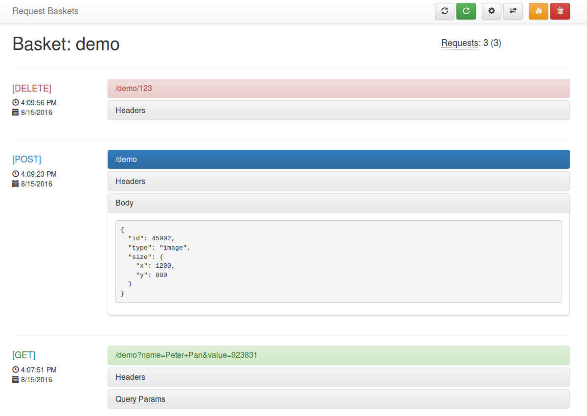

<!-- generated -->

# Request Baskets

1-Click installation template for Request Baskets on Easypanel

## Description

Request Baskets is a lightweight application designed for developers to capture and inspect HTTP requests. It allows creating disposable endpoints to test webhooks, APIs, or any HTTP-based interaction. The application provides an intuitive web interface for monitoring and debugging incoming requests in real time.

## Benefits

- HTTP Request Inspection: Request Baskets allows developers to monitor and debug HTTP requests efficiently, aiding in API testing and development workflows.
- Disposable Endpoints: The app enables the creation of temporary endpoints for testing webhooks, providing a simple and effective solution for temporary integrations.
- Intuitive User Interface: Request Baskets offers a clean and user-friendly interface for viewing and analyzing incoming requests in real time.

## Features

- Multi-Platform Awareness: Request Baskets uses the docker manifest for multi-platform support, ensuring compatibility across various architectures.
- Easy Access: The application can be accessed at specified host addresses, making it straightforward to set up and use.
- Environment Variables: Request Baskets allows for the customization of its behavior through environment variables, offering flexibility for diverse use cases.
- Real-Time Monitoring: The app provides real-time monitoring of HTTP requests, allowing immediate feedback and debugging for developers.

## Links

- [Demo](https://rbaskets.in/web)
- [Github](https://github.com/darklynx/request-baskets)
- [Template Source](https://github.com/easypanel-io/templates/tree/main/templates/request-baskets)

## Options

Name | Description | Required | Default Value
-|-|-|-
App Service Name | - | yes | request-baskets
App Service Image | - | yes | darklynx/request-baskets:v1.2.3

## Screenshots

## Change Log

- 2025-01-22 – First Release

## Contributors

- [Ahson Shaikh](https://github.com/Ahson-Shaikh)
