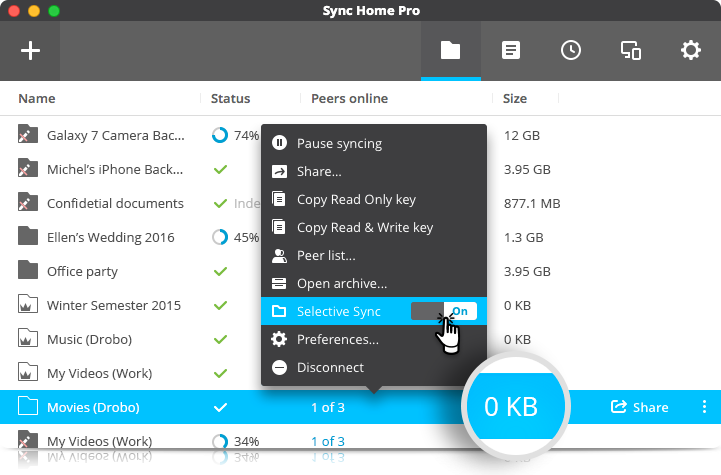

<!-- generated -->

# Resilio Sync

1-Click installation template for Resilio Sync on Easypanel

## Description

Sync (Resilio Sync) is a self-hosted file synchronization and sharing application that allows users to securely sync files between devices without relying on cloud storage. It provides a powerful alternative to proprietary cloud-based file sharing services, ensuring complete control over data and privacy. With Sync, users can transfer large files quickly, collaborate on projects in real-time, and maintain data consistency across multiple devices. Built with efficiency and security in mind, Sync is ideal for both personal and business use.

## Benefits

- Secure and Private File Sync: Sync allows users to sync files directly between devices without relying on cloud storage, ensuring privacy and security.
- High-Speed File Transfers: Sync is optimized for fast file transfers, even with large files, utilizing peer-to-peer technology for efficient data distribution.
- Cross-Platform Support: Sync is available on multiple platforms, including Windows, macOS, Linux, iOS, and Android, making file access seamless across devices.

## Features

- Peer-to-Peer File Sync: Sync directly transfers files between devices using peer-to-peer connections, eliminating the need for centralized cloud storage.
- End-to-End Encryption: Sync ensures that all file transfers are encrypted, protecting sensitive data from unauthorized access.
- Selective Sync: Users can choose specific files or folders to sync, optimizing storage and bandwidth usage.
- Automatic Backup: Keep important files backed up by setting up automatic synchronization between selected devices.
- Folder Sharing and Collaboration: Share files and folders securely with team members, allowing real-time collaboration and access control.

## Links

- [Documentation](https://help.resilio.com/hc/en-us)
- [Dockerhub Documentation](https://hub.docker.com/r/resilio/sync)
- [Template Source](https://github.com/easypanel-io/templates/tree/main/templates/resiliosync)

## Options

Name | Description | Required | Default Value
-|-|-|-
App Service Name | - | yes | resilio-sync
App Service Image | - | yes | resilio/sync:2.8.1

## Screenshots

## Change Log

- 2025-02-06 – First Release

## Contributors

- [Ahson Shaikh](https://github.com/Ahson-Shaikh)
