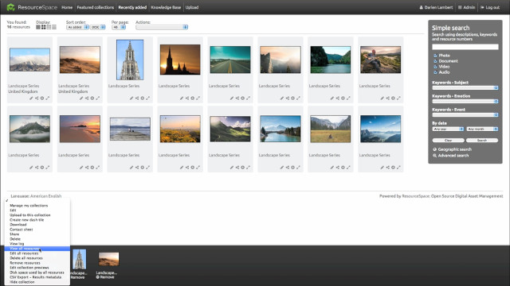

<!-- generated -->

# ResourceSpace

1-Click installation template for ResourceSpace on Easypanel

## Description

ResourceSpace is an open-source Digital Asset Management (DAM) system that helps organizations manage, organize, and share their digital assets efficiently. It provides a web-based interface for managing files, images, videos, and other digital resources with features like metadata management, version control, and access control.

## Benefits

- Digital Asset Management: Efficient management of digital assets and resources.
- Web-Based Interface: User-friendly web interface for asset management.
- Flexible Storage: Support for multiple storage locations and configurations.
- Access Control: Granular access control and user permissions.

## Features

- Asset Management: Comprehensive digital asset management capabilities.
- Metadata Support: Rich metadata management for assets.
- Version Control: Track and manage asset versions.
- Search & Filter: Advanced search and filtering capabilities.

## Links

- [Website](https://www.resourcespace.com/)
- [Documentation](https://www.resourcespace.com/documentation)
- [GitHub](https://github.com/ResourceSpace/ResourceSpace)
- [Template Source](https://github.com/easypanel-io/templates/tree/main/templates/resourcespace)

## Options

Name | Description | Required | Default Value
-|-|-|-
App Service Name | - | yes | resourcespace
ResourceSpace Image | - | yes | creecros/resourcespace-docker:v9.2

## Screenshots

## Change Log

- 2025-03-26 – Initial template release

## Contributors

- [Ahson Shaikh](https://github.com/Ahson-Shaikh)
