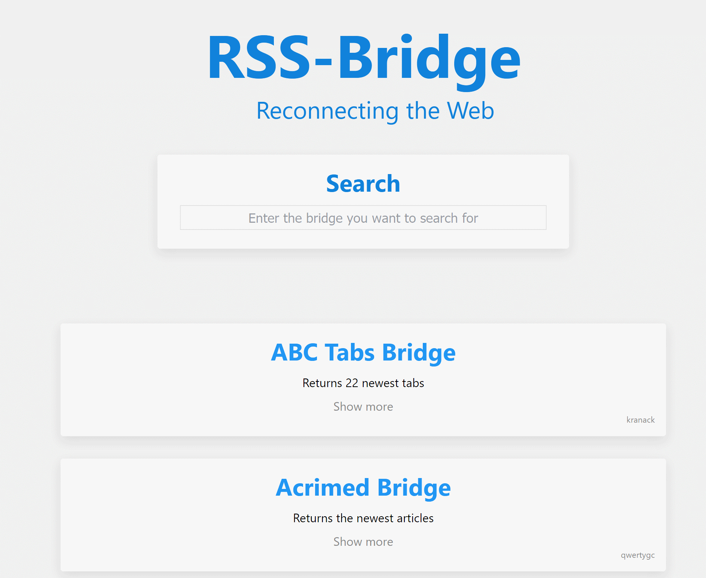

<!-- generated -->

# RSS-Bridge

1-Click installation template for RSS-Bridge on Easypanel

## Description

RSS-Bridge is a self-hosted, open-source tool that generates RSS and Atom feeds for websites that do not provide them natively. It enables users to extract and aggregate content from various web pages, social media platforms, and other online sources into a single, unified RSS feed. This allows users to stay updated with the latest content from multiple sources without manually visiting each site. RSS-Bridge supports various website connectors, filtering options, and output formats to provide a customized feed experience.

## Benefits

- Generate RSS Feeds for Any Website: RSS-Bridge allows you to create RSS and Atom feeds for websites that do not provide them natively. This ensures you can follow updates from any site in your preferred RSS reader.
- Custom Filtering & Formatting: With built-in filtering options, RSS-Bridge enables you to refine feeds based on keywords, categories, and other parameters, ensuring you only receive relevant updates.
- Self-Hosted & Privacy-Focused: RSS-Bridge is open-source and can be self-hosted, providing full control over your feed aggregation while ensuring privacy and avoiding third-party tracking.

## Features

- Multiple Website Connectors: RSS-Bridge supports a wide range of pre-built connectors for popular websites, including news platforms, social media, and blogs, making it easy to generate feeds.
- Various Output Formats: The tool provides multiple output formats, including RSS, Atom, JSON, and plaintext, ensuring compatibility with different feed readers and automation tools.
- Advanced Feed Customization: Users can apply advanced filtering, keyword-based searches, and content trimming to refine their RSS feeds based on their specific interests.
- Lightweight & Fast: RSS-Bridge is designed to be lightweight and efficient, allowing it to run on minimal hardware while delivering real-time updates from various sources.
- No API Keys Required: Unlike many third-party services, RSS-Bridge does not require API keys, making it easy to use without complex setup or rate limits.

## Links

- [Website](https://rss-bridge.github.io/rss-bridge/)
- [GitHub](https://github.com/RSS-Bridge/rss-bridge)
- [Template Source](https://github.com/easypanel-io/templates/tree/main/templates/rss-bridge)

## Options

Name | Description | Required | Default Value
-|-|-|-
App Service Name | - | yes | rss-bridge
App Service Image | - | yes | rssbridge/rss-bridge:sha-549bed6

## Screenshots

## Change Log

- 2025-02-04 – first release

## Contributors

- [Ahson Shaikh](https://github.com/Ahson-Shaikh)
