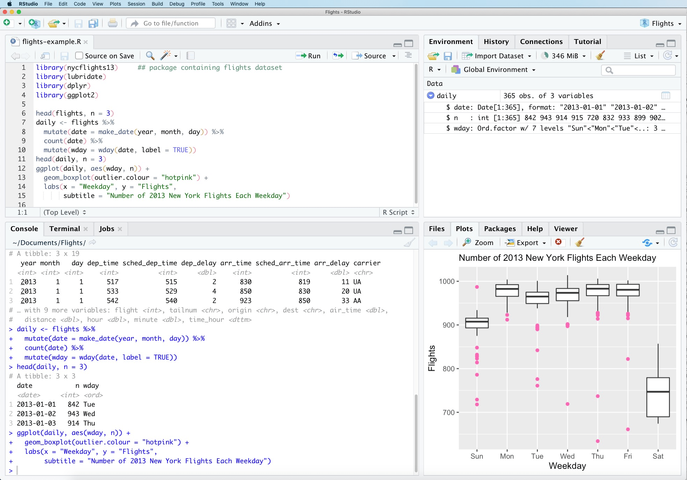

<!-- generated -->

# RStudio

1-Click installation template for RStudio on Easypanel

## Description

RStudio is a powerful integrated development environment (IDE) for R programming and statistical computing. It provides a comprehensive set of tools for data analysis, visualization, and statistical modeling. This server-based version allows you to access RStudio through your web browser, enabling collaborative work and remote access to your R projects from anywhere. Perfect for data scientists, statisticians, and researchers working with R.

## Instructions

Default username is rstudio and password is 1234

## Benefits

- Web-Based IDE: Access a full-featured R development environment through your web browser from any device without local installation.
- Statistical Computing: Powerful tools for statistical analysis, data visualization, and machine learning with extensive R package support.
- Remote Collaboration: Work on R projects remotely and collaborate with team members by sharing access to the same RStudio server instance.
- Data Science Workflows: Integrated support for R Markdown, Shiny apps, version control, and package management for complete data science workflows.

## Features

- Code Editor: Advanced code editor with syntax highlighting, code completion, and debugging tools specifically designed for R.
- Data Visualization: Create interactive plots and visualizations using ggplot2, plotly, and other R visualization libraries.
- Package Management: Easy installation and management of R packages from CRAN, Bioconductor, and GitHub repositories.
- R Markdown Support: Create reproducible reports and documents combining code, output, and narrative text using R Markdown.

## Links

- [Website](https://posit.co/products/open-source/rstudio/)
- [Documentation](https://docs.posit.co/ide/server-pro/)
- [GitHub](https://github.com/rstudio/rstudio)
- [Template Source](https://github.com/easypanel-io/templates/tree/main/templates/rstudio)

## Options

Name | Description | Required | Default Value
-|-|-|-
App Service Name | - | yes | rstudio
App Service Image | - | yes | rocker/rstudio:4.5.2
Password | - | yes | 1234

## Screenshots

## Change Log

- 2025-10-13 – Initial Template Release (4.5)

## Contributors

- [Ahson Shaikh](https://github.com/Ahson-Shaikh)
