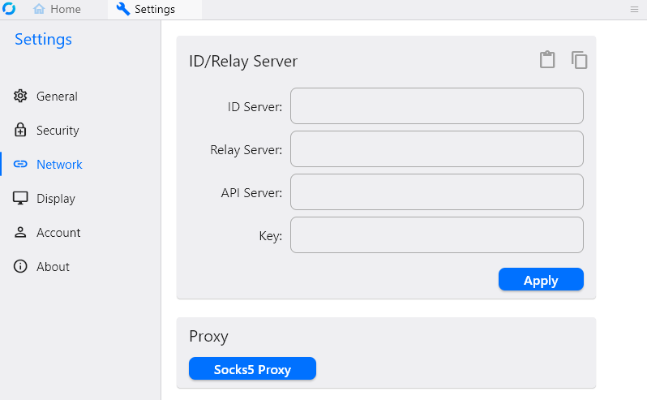

<!-- generated -->

# Rustdesk

1-Click installation template for Rustdesk on Easypanel

## Description

Rustdesk is a self-hosted remote desktop application that allows you to access and control devices remotely. It provides an open-source alternative to proprietary remote desktop software, offering full control over your own remote access infrastructure. With Rustdesk, users can securely connect to their computers from anywhere, manage remote desktops efficiently, and ensure privacy by hosting their own Rustdesk relay and ID server. Rustdesk is built with high-performance and encryption in mind, making it suitable for both personal and enterprise use.

## Benefits

- Secure Remote Access: Rustdesk provides a fully encrypted remote desktop solution, ensuring that your data remains private and secure. You can host your own Rustdesk relay and ID server to maintain control over your connections.
- Cross-Platform Support: Rustdesk is compatible with multiple operating systems, including Windows, macOS, Linux, iOS, and Android, allowing seamless remote access across devices.
- Lightweight and High-Performance: Rustdesk is designed to be lightweight while offering high performance for remote desktop connections. It provides smooth screen sharing and input control, even on lower bandwidth connections.

## Features

- Self-Hosted Server: Rustdesk allows you to deploy and manage your own relay and ID server, providing full control over remote access connections and eliminating reliance on third-party servers.
- End-to-End Encryption: Rustdesk ensures security through end-to-end encryption, protecting communication between the client and the remote device.
- File Transfer: Users can transfer files between local and remote machines easily, making it a convenient solution for remote work and troubleshooting.
- Unattended Access: Rustdesk supports unattended access, allowing users to connect to remote machines without requiring manual acceptance each time.
- Multi-Monitor Support: Rustdesk provides multi-monitor support, making it easy to navigate between different screens in a remote desktop session.

## Links

- [Documentation](https://rustdesk.com/docs/en/)
- [Github](https://github.com/rustdesk/rustdesk)
- [Template Source](https://github.com/easypanel-io/templates/tree/main/templates/rustdesk)

## Options

Name | Description | Required | Default Value
-|-|-|-
App Service Name | - | yes | rustdesk
App Service Image | - | yes | rustdesk/rustdesk-server:1.1.14

## Screenshots

## Change Log

- 2025-02-05 – First Release

## Contributors

- [Ahson Shaikh](https://github.com/Ahson-Shaikh)
