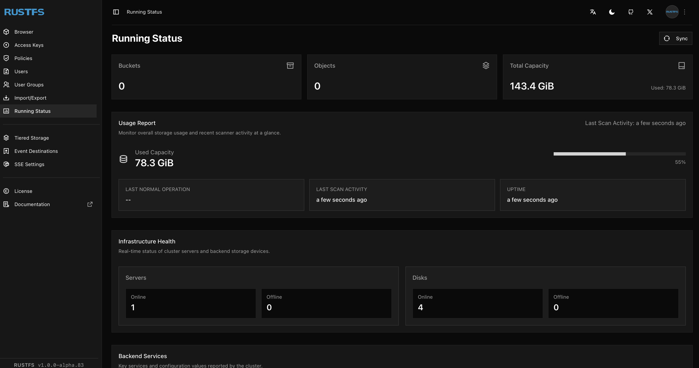

<!-- generated -->

# RustFS

1-Click installation template for RustFS on Easypanel

## Description

RustFS is a high-performance, S3-compatible object storage system built in Rust. It is 2.3x faster than MinIO for small object payloads and offers full S3 API compatibility, a built-in web management console, erasure coding with Reed-Solomon for data protection, bitrot detection via HighwayHash, and server-side encryption with AES-256-GCM and ChaCha20-Poly1305. RustFS supports event notifications, bucket versioning, object lifecycle management, bucket replication, and CORS configuration. Licensed under the permissive Apache 2.0 license, it is designed for data lakes, AI workloads, and large-scale storage with a user-friendly deployment experience.

## Instructions

Login to the web console using the Access Key and Secret Key configured during setup. The console is available on the default domain.

## Benefits

- Blazing Fast Performance: Built in Rust for maximum speed and memory safety. 2.3x faster than MinIO for 4KB object payloads with efficient resource utilization on standard hardware.
- Full S3 Compatibility: Strict adherence to S3 API standards with AWS Signature V4 support. Drop-in replacement for MinIO, Ceph, or any S3-compatible storage with seamless migration.
- Enterprise Data Protection: Erasure coding with Reed-Solomon, bitrot protection via HighwayHash, and server-side encryption with AES-256-GCM and ChaCha20-Poly1305 keep your data safe and intact.
- Permissive Apache 2.0 License: No AGPL restrictions or license traps. Fully open-source under Apache 2.0 for unrestricted commercial and community use.

## Features

- Web Management Console: Built-in browser-based console for managing buckets, objects, users, policies, and monitoring server health and performance.
- Bucket Versioning & Replication: Version your objects for point-in-time recovery and replicate buckets across sites for disaster recovery and high availability.
- Event Notifications: Configure event notifications for object operations to trigger downstream workflows via webhooks, AMQP, Kafka, NATS, and more.
- Object Caching: Built-in object cache with configurable TTL for improved read performance on frequently accessed data.
- S3 Select: Query CSV, Parquet, and JSON objects directly with SIMD-optimized S3 Select without downloading entire files.
- TLS & Encryption: Network encryption with TLS 1.2+ and server-side encryption at rest. Supports external KMS providers including HashiCorp Vault.

## Links

- [GitHub](https://github.com/rustfs/rustfs)
- [Documentation](https://docs.rustfs.com)
- [Website](https://rustfs.com)
- [Template Source](https://github.com/easypanel-io/templates/tree/main/templates/rustfs)

## Options

Name | Description | Required | Default Value
-|-|-|-
App Service Name | - | yes | rustfs
RustFS Image | - | yes | rustfs/rustfs:1.0.0-alpha.83
Access Key | Root access key for the S3 API and console login. | no | rustfsadmin
Secret Key | Root secret key for the S3 API and console login. Leave blank to generate a random one. | no | 

## Screenshots

## Change Log

- 2026-02-19 – Template Release

## Contributors

- [Ahson Shaikh](https://github.com/Ahson-Shaikh)
