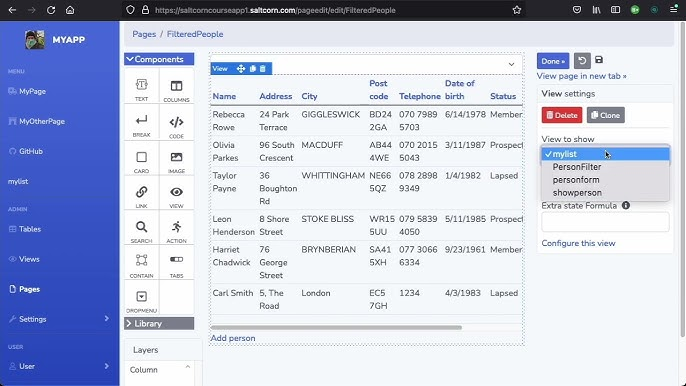

<!-- generated -->

# Saltcorn

1-Click installation template for Saltcorn on Easypanel

## Description

Saltcorn is an extensible open-source no-code database application builder. It allows you to build web applications based on relational data with flexible views, data types, and layouts. With Saltcorn, you can create dynamic applications without writing code, making it a powerful tool for both developers and non-developers alike.

## Instructions

Delete the migration container, once that is done with migrations.

## Benefits

- No-Code Database Application Builder: Saltcorn allows users to create database-driven applications without coding, making development accessible to all skill levels.
- Self-Hosted & Secure: Host your applications on your own infrastructure, ensuring privacy and complete control over your data.
- Flexible Data Models & Views: Design relational databases with customized views, data types, and layouts that fit your specific needs.

## Features

- Drag-and-Drop UI Builder: Easily create application interfaces with an intuitive drag-and-drop editor.
- Relational Database Support: Define relationships between different data models to build complex applications.
- Multi-Tenant Hosting: Run multiple instances of Saltcorn on a single installation, enabling SaaS-style deployments.
- Plugin & Theme Support: Extend Saltcorn's functionality with community-developed plugins and themes.

## Links

- [Documentation](https://saltcorn.com/)
- [Github](https://github.com/saltcorn/saltcorn)
- [Template Source](https://github.com/easypanel-io/templates/tree/main/templates/saltcorn)

## Options

Name | Description | Required | Default Value
-|-|-|-
App Service Name | - | yes | saltcorn
App Service Image | - | yes | saltcorn/saltcorn:1.3.0

## Screenshots

## Change Log

- 2025-03-13 – Template Release
- 2025-07-24 – Version bumped to 1.3.0

## Contributors

- [Ahson Shaikh](https://github.com/Ahson-Shaikh)
