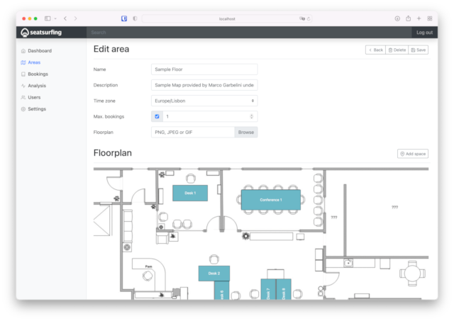

<!-- generated -->

# SeatSurfing

1-Click installation template for SeatSurfing on Easypanel

## Description

SeatSurfing is a comprehensive desk and room booking system that helps organizations manage their workspace efficiently. It provides a user-friendly interface for employees to book desks and meeting rooms, while giving administrators powerful tools to manage spaces, users, and bookings. The system includes features like real-time availability, booking management, and analytics to optimize space utilization.

## Instructions

Login email admin@seatsurfing.local and password 12345678

## Benefits

- Workspace Management: Efficiently manage desks and meeting rooms with real-time availability tracking.
- User-Friendly Interface: Intuitive booking interface for employees and powerful admin tools for managers.
- Space Optimization: Analytics and reporting tools to optimize space utilization and reduce costs.
- Flexible Configuration: Customizable settings for different types of spaces and booking rules.
- Integration Ready: API support for integration with other workplace management systems.

## Features

- Desk Booking: Book desks with real-time availability and flexible booking options.
- Room Management: Manage meeting rooms with capacity tracking and equipment booking.
- User Management: Manage users, roles, and permissions with ease.
- Analytics: Track space utilization and generate reports for better decision making.
- Mobile Support: Access the system from any device with responsive design.

## Links

- [Website](https://seatsurfing.app/)
- [Documentation](https://docs.seatsurfing.app/)
- [Github](https://github.com/seatsurfing)
- [Template Source](https://github.com/easypanel-io/templates/tree/main/templates/seatsurfing)

## Options

Name | Description | Required | Default Value
-|-|-|-
App Service Name | - | yes | seatsurfing
App Service Image | - | yes | seatsurfing/backend:1.28.0
Booking Service Image | - | yes | seatsurfing/booking-ui:1.28.0
Admin Service Image | - | yes | seatsurfing/admin-ui:1.28.0

## Screenshots

## Change Log

- 2025-04-07 – First Release

## Contributors

- [Ahson Shaikh](https://github.com/Ahson-Shaikh)
