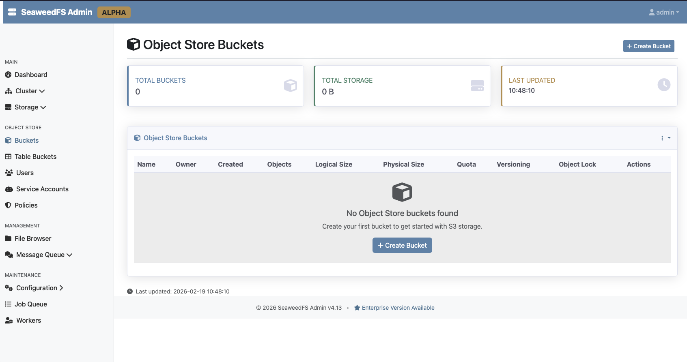

<!-- generated -->

# SeaweedFS

1-Click installation template for SeaweedFS on Easypanel

## Description

SeaweedFS is a fast, simple, and highly scalable distributed file system for storing and serving billions of files. Starting as an object store with O(1) disk seek performance, it has grown into a full-featured storage platform supporting S3 API, WebDAV, FUSE mount, HDFS, and Hadoop integration. The architecture separates concerns into a master server for volume management, a volume server for blob storage, a filer for directory/file abstraction, an S3 gateway for S3 compatibility, and a WebDAV server for mounted drive access. Features include erasure coding, cloud tiering, cross-datacenter replication, AES-256-GCM encryption, automatic compaction, file TTL, and a built-in admin UI. Licensed under Apache 2.0 with 30k+ GitHub stars.

## Instructions

Open the admin UI.

## Benefits

- Billion-File Scale: Designed from the ground up to store billions of files with O(1) disk seek performance. Each file lookup requires just one disk read operation with only 40 bytes of metadata overhead per file.
- Multi-Protocol Access: Access your data via S3 API, WebDAV, FUSE mount, HDFS, or the built-in Filer HTTP interface. Use the right protocol for every use case without data duplication.
- Cloud Tiering & Replication: Transparently tier warm data to cloud storage (AWS S3, Google Cloud, Azure) while keeping hot data local. Cross-datacenter active-active replication ensures high availability.
- Apache 2.0 Licensed: Fully open-source under the permissive Apache 2.0 license with no restrictive copyleft clauses. Free for commercial and community use.

## Features

- S3-Compatible Gateway: Full Amazon S3 API compatibility lets you use existing S3 tools, SDKs, and applications. Drop-in replacement for cloud object storage.
- WebDAV Server: Mount your SeaweedFS storage as a network drive on macOS, Windows, and Linux, or access it from mobile devices via WebDAV.
- Admin UI: Built-in web administration console for monitoring cluster health, managing volumes, viewing topology, and performing maintenance.
- Erasure Coding: Reed-Solomon erasure coding (10.4 by default, customizable in Enterprise) reduces storage overhead while maintaining data durability across racks.
- Encryption at Rest: AES-256-GCM encrypted storage protects data at rest. Combined with TLS for data in transit, your files are secured end to end.
- Automatic Compaction: Automatically reclaims disk space after file deletion or updates. Combined with file TTL support for automatic expiration of temporary data.

## Links

- [GitHub](https://github.com/seaweedfs/seaweedfs)
- [Documentation](https://github.com/seaweedfs/seaweedfs/wiki)
- [Website](https://seaweedfs.com)
- [Template Source](https://github.com/easypanel-io/templates/tree/main/templates/seaweedfs)

## Options

Name | Description | Required | Default Value
-|-|-|-
App Service Name | - | yes | seaweedfs
SeaweedFS Image | - | yes | chrislusf/seaweedfs:4.13

## Screenshots

## Change Log

- 2026-02-19 – Template Release (4.13)

## Contributors

- [Ahson Shaikh](https://github.com/Ahson-Shaikh)
