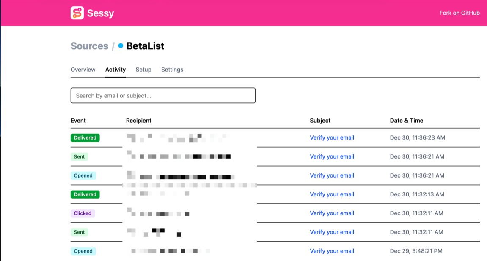

<!-- generated -->

# Sessy

1-Click installation template for Sessy on Easypanel

## Description

Sessy is a self-hosted web application built with Ruby on Rails designed for managing and interacting with AWS Simple Email Service (SES). The application provides a user-friendly interface for managing email sending operations, monitoring email delivery, and working with AWS SES configurations. With persistent storage for application data, Sessy ensures your settings and configurations are retained across container restarts. The application offers a straightforward deployment model with minimal configuration requirements, making it easy to set up and operate. Built on the robust Ruby on Rails framework, Sessy provides a reliable foundation for email service management. Perfect for developers and teams working with AWS SES who want a self-hosted management interface, organizations needing a simple way to interact with their email service infrastructure, or anyone looking for a lightweight self-hosted solution for AWS SES operations without relying on external services.

## Benefits

- AWS SES Management: Simplified interface for managing AWS Simple Email Service operations and configurations from a single self-hosted application.
- Simple Deployment: Easy-to-deploy Rails application with minimal configuration requirements for quick setup and operation.
- Persistent Storage: Application data is stored persistently ensuring your information is retained across container restarts.
- Self-Hosted Control: Complete control over your email service management and data with a self-hosted solution.

## Features

- AWS SES Integration: Direct integration with AWS Simple Email Service for managing email sending operations and configurations.
- Email Management Interface: User-friendly web interface for monitoring email delivery, managing configurations, and interacting with AWS SES.
- Rails-Based: Built on Ruby on Rails framework providing a robust and reliable application foundation.
- Persistent Data Storage: Application data stored in persistent volumes ensuring data retention and reliability.

## Links

- [Website](https://sessy.do)
- [GitHub](https://github.com/marckohlbrugge/sessy)
- [Docker Hub](https://hub.docker.com/r/marckohlbrugge/sessy)
- [Template Source](https://github.com/easypanel-io/templates/tree/main/templates/sessy)

## Options

Name | Description | Required | Default Value
-|-|-|-
App Service Name | - | yes | sessy
App Service Image | - | yes | ghcr.io/marckohlbrugge/sessy:sha-8d93bde

## Screenshots

## Change Log

- 2026-01-02 – Template Release

## Contributors

- [Ahson Shaikh](https://github.com/Ahson-Shaikh)
