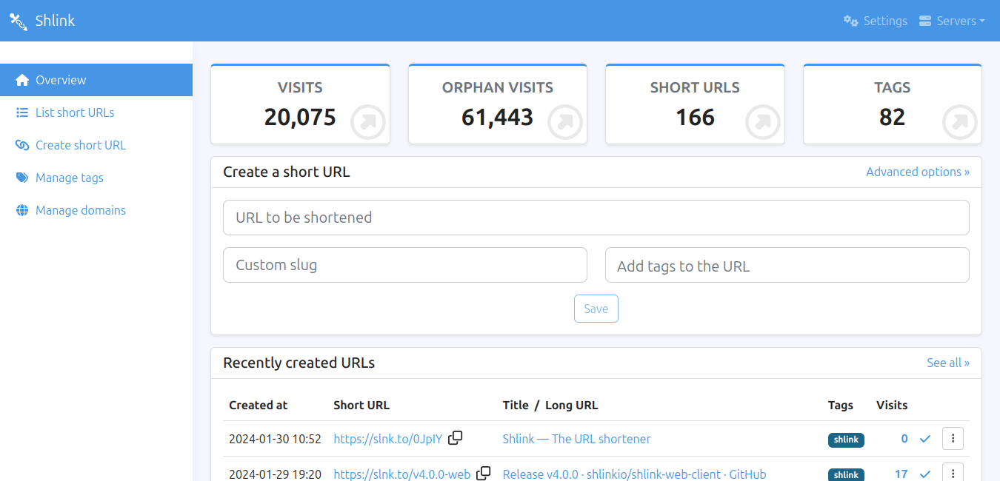

<!-- generated -->

# Shlink

1-Click installation template for Shlink on Easypanel

## Description

Shlink is an open-source URL shortener that allows you to create a short URL for your website. It provides a simple and intuitive interface that allows you to create a short URL for your website.

## Instructions

To use this service we need a license key. Create an Account for GeoLite2, Generate a license key, and add it.

## Benefits

- Cross-Platform Support: Shlink is a cross-platform URL shortener that works seamlessly on various operating systems, including Linux, Windows, and macOS. This makes it easy to deploy and manage your short URLs on any platform.
- Easy Link Management: Shlink provides a user-friendly interface and API for managing short URLs, making it easy to create, customize, and track URLs without any hassle.
- Detailed Analytics: Shlink offers detailed analytics for every short URL, including the number of visits, referrers, device types, and geographical data. This helps users gain valuable insights into their audience and link performance.

## Features

- Custom Domains: Shlink supports custom domains, allowing users to create branded short URLs that reflect their identity and improve user trust.
- RESTful API: Shlink includes a powerful RESTful API that allows for easy integration with other applications and automated URL management.
- Geolocation and Device Tracking: Shlink provides geolocation and device tracking for each click, offering insights into where visitors are coming from and what devices they are using.
- QR Code Generation: Automatically generate QR codes for every short URL, making it easy to share links through print media and offline channels.
- Secure and Open Source: Shlink is an open-source project with a focus on security and privacy. Users can self-host it for complete control over their data.

## Links

- [Website](https://shlink.io/)
- [Documentation](https://shlink.io/documentation/)
- [Github](https://github.com/shlinkio/shlink)
- [Template Source](https://github.com/easypanel-io/templates/tree/main/templates/shlink)

## Options

Name | Description | Required | Default Value
-|-|-|-
App Service Name | - | yes | shlink
App Service Image | - | yes | shlinkio/shlink:4.6.0
GeoLite2 API Key | Generate a license key from your GeoLite2 account. | yes | 

## Screenshots

## Change Log

- 2025-02-14 – first release
- 2025-07-24 – Version bumped to 4.5
- 2025-12-29 – Version bumped to 4.6.0

## Contributors

- [Ahson Shaikh](https://github.com/Ahson-Shaikh)
