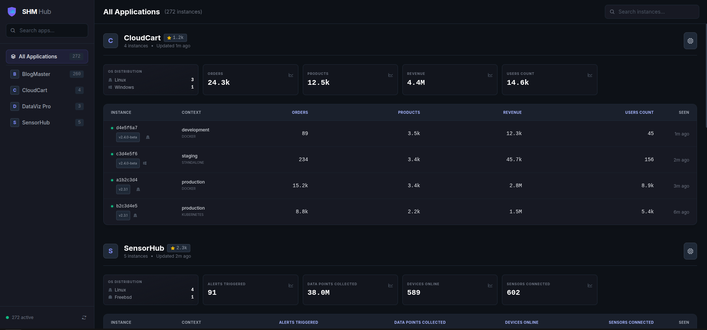

<!-- generated -->

# SHM

1-Click installation template for SHM on Easypanel

## Description

SHM (Self-Hosted Metrics) is privacy-first, agnostic telemetry for self-hosted software—collect usage stats, verify active instances, and understand adoption without spying on users. Instances sign payloads with Ed25519; PostgreSQL stores JSON metrics behind a single Go binary with an embedded dashboard (port 8080). AGPL-3.0; upstream lives under the kOlapsis GitHub organization.

## Benefits

- Privacy-first telemetry: Aggregate counters and signed snapshots—no user content; built for self-hosted product owners who need adoption insight.
- Agnostic payloads: Send JSON metrics; the dashboard adapts with dynamic KPIs and tables.
- PostgreSQL backend: Stores payloads in PostgreSQL via SHM_DB_DSN; Easypanel provisions a postgres service.
- Embedded UI: Single container serves API and dashboard on port 8080.

## Features

- Ed25519 instance identity: Cryptographic registration and signed snapshots reduce spoofing.
- Multi-app tracking: Track several products on one SHM server.
- Badges & GitHub stars: Optional embeddable badges and GitHub star integration when configured.
- SDKs: Go and Node clients for integrating telemetry into your apps.

## Links

- [Website](https://self-hosted-metrics.com/)
- [GitHub](https://github.com/kOlapsis/shm)
- [Documentation](https://github.com/kOlapsis/shm/blob/main/docs/DEPLOYMENT.md)
- [Container registry](https://github.com/kOlapsis/shm/pkgs/container/shm)
- [Template Source](https://github.com/easypanel-io/templates/tree/main/templates/shm)

## Options

Name | Description | Required | Default Value
-|-|-|-
App Service Name | - | yes | shm
App Service Image | - | yes | ghcr.io/kolapsis/shm:sha-fd3affa

## Screenshots

## Change Log

- 2025-01-29 – Initial Template Release

## Contributors

- [Ahson Shaikh](https://github.com/Ahson-Shaikh)
