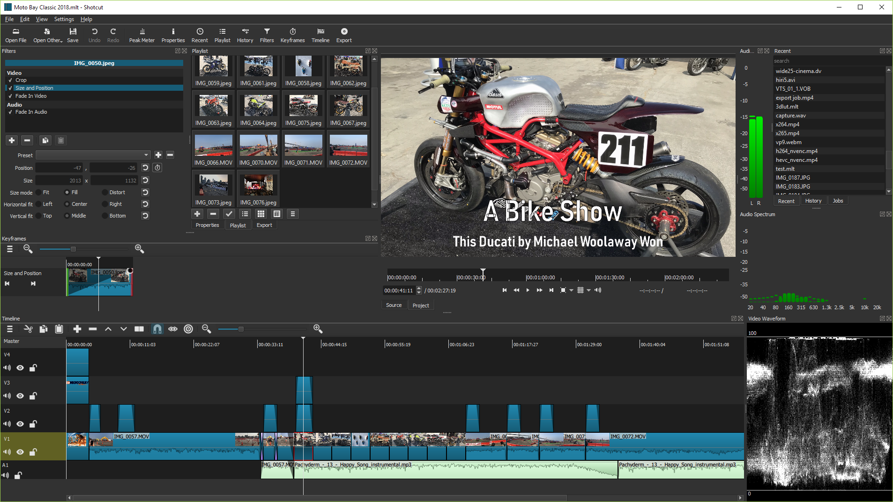

<!-- generated -->

# Shotcut

1-Click installation template for Shotcut on Easypanel

## Description

Shotcut is a free, open-source, cross-platform video editor that enables users to create and edit professional-quality videos. Written in C++, it supports a wide range of video formats and codecs thanks to FFmpeg integration. Shotcut provides powerful features such as multi-format timeline editing, 4K resolution support, and advanced video effects and filters. The app offers intuitive drag-and-drop functionality, customizable UI, and support for hardware acceleration. It also includes audio editing tools, frame-accurate seeking, and video compositing capabilities. Shotcut is designed to be user-friendly while offering advanced tools for video enthusiasts and professionals alike. Additional features include support for network stream playback, webcam capture, and external monitoring.

## Benefits

- Cross-Platform Support: Shotcut works seamlessly on Windows, macOS, and Linux, allowing users to edit videos across different operating systems with consistent functionality and performance.
- Wide Format Support: Thanks to FFmpeg integration, Shotcut supports hundreds of audio, video, and image formats and codecs, making it highly versatile and capable of handling almost any media file.
- Advanced Video Editing Features: Shotcut offers advanced features such as keyframe animations, customizable video filters, multi-track timeline editing, and 4K video support, making it ideal for professional video projects.

## Features

- Multi-Format Timeline: This feature allows you to mix and match resolutions and frame rates within a single project timeline, providing unmatched flexibility for editing.
- Video Effects and Filters: Shotcut includes a wide range of video filters, including color grading, chroma key, transitions, and text overlays, enabling users to enhance and customize their videos.
- Hardware Acceleration: Shotcut supports GPU-based rendering and encoding, significantly improving performance and reducing rendering times for complex projects.
- Audio Editing Tools: Shotcut includes tools for audio mixing, waveform visualization, and support for audio filters such as gain, bass, treble, and normalization.
- Open Source Community: Being open-source, Shotcut has an active community contributing to its development and providing support to users worldwide.

## Links

- [Website](https://www.shotcut.org/)
- [Github](https://github.com/mltframework/shotcut)
- [Template Source](https://github.com/easypanel-io/templates/tree/main/templates/shotcut)

## Options

Name | Description | Required | Default Value
-|-|-|-
App Service Name | - | yes | shotcut
App Service Image | - | yes | lscr.io/linuxserver/shotcut:24.11.17

## Screenshots

## Change Log

- 2025-01-22 – first release

## Contributors

- [Ahson Shaikh](https://github.com/Ahson-Shaikh)
