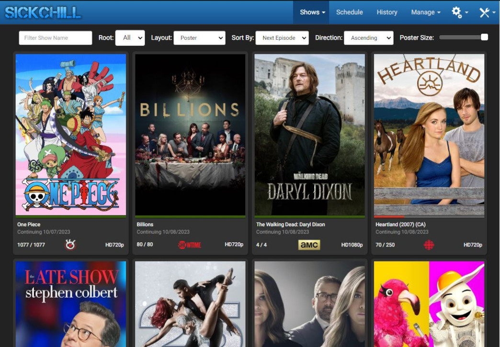

<!-- generated -->

# Sickchill

1-Click installation template for Sickchill on Easypanel

## Description

SickChill is a self-hosted personal video recorder (PVR) application designed to automate the process of downloading and managing TV shows. It supports a wide range of sources to download content, including torrents and Usenet. With its intuitive interface, you can search for and schedule episodes, track your show library, and get detailed information about your favorite series. SickChill integrates with various media players and tools to organize and play content seamlessly. It also includes features like automatic quality selection, subtitles, and episode renaming for a streamlined viewing experience.

## Benefits

- Automated TV Show Management: SickChill automates the process of managing your TV shows. It tracks your favorite series and automatically downloads new episodes as they become available, saving you time and effort.
- Broad Download Source Support: SickChill supports both torrent and Usenet downloads. This versatility ensures that you can use your preferred downloading method for acquiring content efficiently.
- Smart Quality Management: With SickChill, you can define quality preferences for your downloads. It will automatically select and download episodes in the desired quality, ensuring the best viewing experience.

## Features

- Automatic Subtitles: SickChill includes support for automatically downloading subtitles for your episodes. This ensures that your content is accessible and enjoyable for a global audience.
- Episode Renaming: This feature renames episodes according to a user-defined format. It keeps your media library organized and makes it easier to find and play your content.
- Integration with Media Players: SickChill integrates seamlessly with popular media players, allowing you to play your downloaded content directly. This creates a cohesive entertainment experience.
- Extensive Show Library Tracking: SickChill provides detailed tracking of your show library, including upcoming episodes, previously watched content, and missing episodes.
- Notifications and Alerts: Receive notifications and alerts when new episodes are available or when downloads are complete. Stay updated without needing to check manually.

## Links

- [Documentation](https://github.com/SickChill/SickChill/wiki)
- [Github](https://github.com/SickChill/SickChill)
- [Template Source](https://github.com/easypanel-io/templates/tree/main/templates/sickchill)

## Options

Name | Description | Required | Default Value
-|-|-|-
App Service Name | - | yes | sickchill
App Service Image | - | yes | linuxserver/sickchill:2024.3.1

## Screenshots

## Change Log

- 2025-01-22 – First Release

## Contributors

- [Ahson Shaikh](https://github.com/Ahson-Shaikh)
