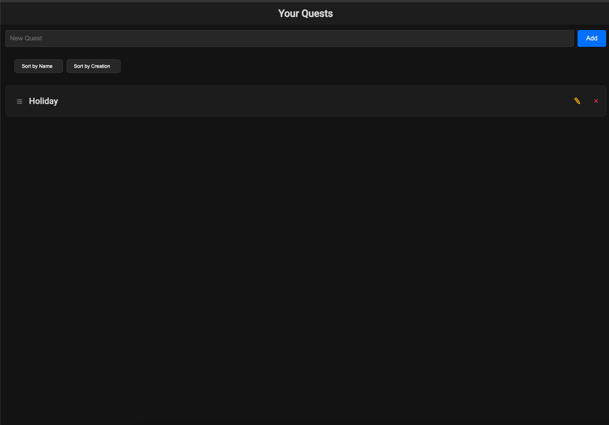

<!-- generated -->

# SideQuests

1-Click installation template for SideQuests on Easypanel

## Description

SideQuests is a task management application that helps you organize and track your tasks and projects. It provides a simple and intuitive interface for managing your daily activities and side projects.

## Benefits

- Task Management: Organize and track your tasks efficiently
- Simple Interface: User-friendly interface for easy task management
- Project Organization: Keep your projects and tasks well-organized
- Self-Hosted: Keep your data private and secure

## Features

- Task Creation: Create and manage tasks with ease
- Project Organization: Organize tasks into projects
- User Management: Manage user access and permissions
- Data Persistence: Save your tasks and projects securely
- Customizable: Configure to your specific needs

## Links

- [GitHub](https://github.com/need4swede/sidequests)
- [Template Source](https://github.com/easypanel-io/templates/tree/main/templates/sidequests)

## Options

Name | Description | Required | Default Value
-|-|-|-
App Service Name | - | yes | sidequests
App Service Image | - | yes | need4swede/sidequests:1.1.5
Admin Username | - | yes | adminuser
Admin Password | - | yes | adminpassword

## Screenshots

## Change Log

- 2025-04-09 – First Release
- 2026-05-08 – Version bumped to 1.1.5

## Contributors

- [Ahson Shaikh](https://github.com/Ahson-Shaikh)
