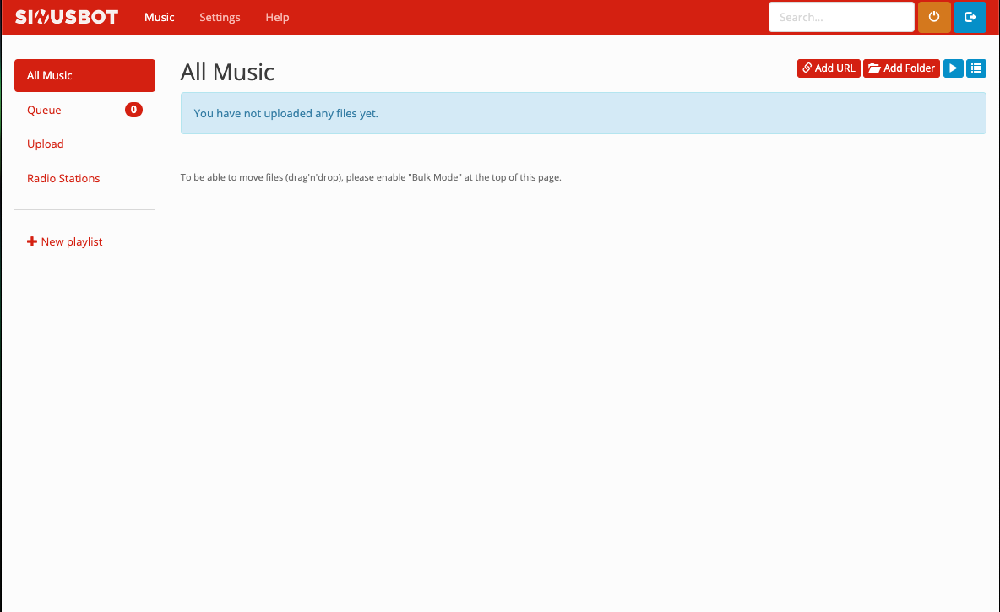

<!-- generated -->

# Sinusbot

1-Click installation template for Sinusbot on Easypanel

## Description

Sinusbot is a powerful and versatile music bot designed for communication platforms like TeamSpeak and Discord. It allows users to stream high-quality audio, manage playlists, and automate music playback seamlessly. Sinusbot is lightweight, highly customizable, and provides an intuitive web interface for managing audio playback. With support for plugins and scripting, Sinusbot can be tailored to meet the needs of any community, enhancing the audio experience for gaming, collaboration, or leisure activities.

## Instructions

Create a user using this command &quot;useradd --no-create-home -s /sbin/nologin -U sinusbot&quot;, then create directories using this command &quot;mkdir -p /opt/sinusbot/data /opt/sinusbot/scripts&quot;, then give user permissions to this folder using this command &quot;chown -R sinusbot:sinusbot /opt/sinusbot&quot;, then run echo $(id -u sinusbot) and echo $(id -g sinusbot) and copy the uid and guid, paste the given ids in the Environmental Section and redeploy, if UID/GUID is&quot;1000&quot;/&quot;1000&quot;, then just redeploy after performing the above instructions

## Benefits

- High-Quality Audio Streaming: Sinusbot delivers crystal-clear audio for your community, ensuring a top-notch listening experience.
- Easy-to-Use Interface: Manage playlists, stream audio, and control playback effortlessly with the user-friendly web interface.
- Customizable with Plugins: Extend Sinusbot’s functionality with plugins and scripts to meet your specific requirements.
- Multi-Platform Support: Compatible with both Discord and TeamSpeak, making it versatile for various communication needs.
- Lightweight and Efficient: Sinusbot is resource-friendly, ensuring smooth performance without overloading your server.

## Features

- Playlist Management: Create and manage playlists easily, supporting multiple audio formats and streaming sources.
- Auto-DJ Mode: Enable Auto-DJ to keep the music playing continuously without manual intervention.
- Scripting Support: Use JavaScript-based scripts to automate and customize your bot's behavior.
- Multi-Instance Support: Run multiple bot instances on the same server to cater to different channels or platforms.
- Advanced Permissions System: Assign roles and permissions to control who can manage the bot or access specific features.

## Links

- [Documentation](https://sinusbot.github.io/docs/)
- [Github](https://github.com/SinusBot)
- [Template Source](https://github.com/easypanel-io/templates/tree/main/templates/sinusbot)

## Options

Name | Description | Required | Default Value
-|-|-|-
App Service Name | - | yes | sinusbot
App Service Image | - | yes | sinusbot/docker:1.0.2
App Service Password | - | yes | password

## Screenshots

## Change Log

- 2025-01-21 – First Release

## Contributors

- [Ahson Shaikh](https://github.com/Ahson-Shaikh)
