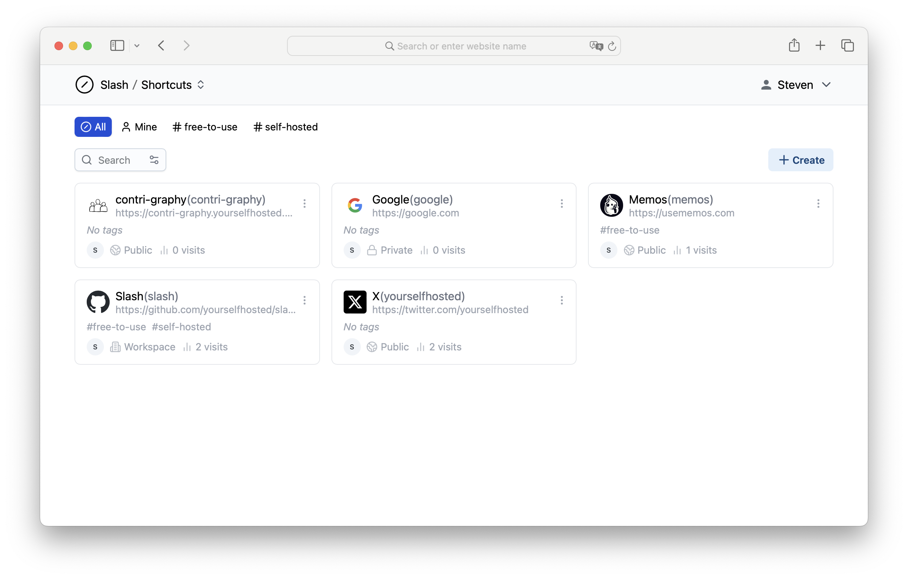

<!-- generated -->

# Slash

1-Click installation template for Slash on Easypanel

## Description

Slash is an open source, self-hosted platform designed to help you organize, manage, and share your most important links. Easily create customizable, human-readable shortcuts to streamline your link management. Use tags to categorize your links and share them easily with your team or publicly.

## Benefits

- Efficient Link Management: Slash is an open-source, self-hosted platform designed to help you organize, manage, and share your most important links. It provides an intuitive interface for creating, managing, and categorizing links effortlessly.
- Customizable Shortcuts: With Slash, you can create human-readable, customizable shortcuts for your links. This makes it easy to share and remember important URLs without relying on cryptic or auto-generated links.
- Tag-Based Organization: Slash supports a powerful tag-based system for organizing your links. Easily categorize and filter your links using tags, helping you keep everything structured and easy to find.

## Features

- Self-Hosting Capability: Slash is designed to be self-hosted, giving you full control over your data and ensuring privacy and security in managing your links.
- Public and Team Sharing: Share your links publicly or with specific teams, making collaboration simple and efficient. This feature is ideal for teams that need to manage and share resources regularly.
- Search and Filter: Slash offers a robust search and filter function, making it easy to find links based on keywords, tags, or custom shortcuts.
- API Support: Slash includes API support for integrating link management with other applications and automating workflows, providing flexibility and enhanced productivity.
- Analytics and Insights: Gain insights into how your links are being used with built-in analytics. Track visits, referrers, and other data to better understand link performance.

## Links

- [Github](https://github.com/yourselfhosted/slash)
- [Template Source](https://github.com/easypanel-io/templates/tree/main/templates/slash)

## Options

Name | Description | Required | Default Value
-|-|-|-
App Service Name | - | yes | slash
App Service Image | - | yes | yourselfhosted/slash:0.5.3

## Screenshots

## Change Log

- 2025-02-14 – First Release

## Contributors

- [Ahson Shaikh](https://github.com/Ahson-Shaikh)
