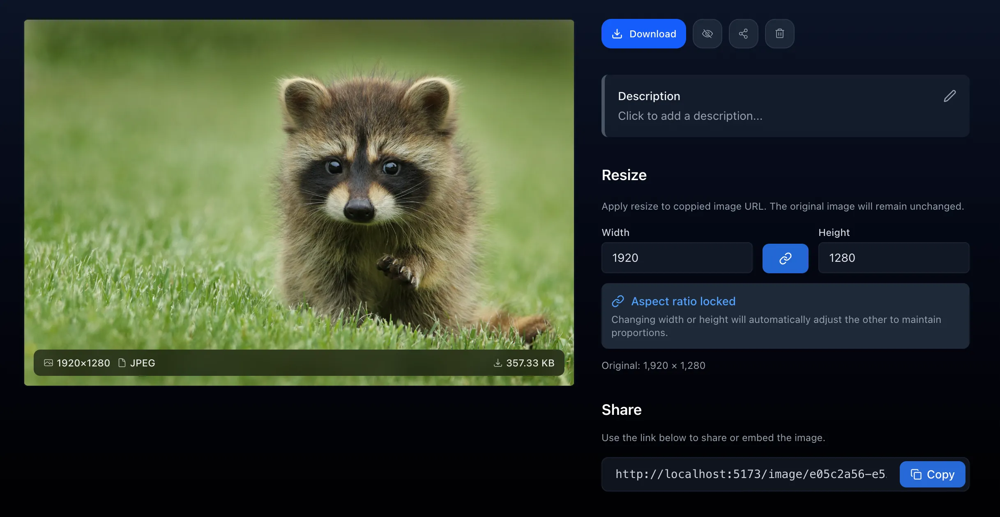

<!-- generated -->

# Slink

1-Click installation template for Slink on Easypanel

## Description

Slink is a self-hosted image hosting service that provides secure image upload, storage, and sharing capabilities. It features user management with approval workflows, configurable password requirements, and image processing options. Perfect for teams and organizations that need controlled image sharing.

## Benefits

- Image Hosting: Secure image upload, storage, and sharing with user management and approval workflows.
- User Management: Controlled user registration with approval requirements and configurable password policies.
- Image Processing: Automatic image compression, EXIF metadata removal, and size optimization for efficient storage.
- Self-Hosted: Complete control over your image data with no external dependencies or data sharing.

## Features

- Web Interface: Clean, responsive web interface for image management.
- User Approval System: Admin approval required for new user registrations.
- Password Requirements: Configurable password strength requirements.
- Image Processing: Automatic compression and metadata removal.
- Size Limits: Configurable maximum image size limits.
- Storage Options: Support for local and cloud storage providers.
- Data Persistence: Database and image storage persist across restarts.
- Security Features: EXIF metadata removal and secure image handling.

## Links

- [GitHub](https://github.com/anirdev/slink)
- [Documentation](https://docs.slinkapp.io)
- [DockerHub](https://hub.docker.com/r/anirdev/slink)
- [Template Source](https://github.com/easypanel-io/templates/tree/main/templates/slink)

## Options

Name | Description | Required | Default Value
-|-|-|-
App Service Name | - | yes | slink
App Service Image | - | yes | anirdev/slink:v1.6.7

## Screenshots

## Change Log

- 2025-09-25 – First release (v1.6.7)

## Contributors

- [Ahson Shaikh](https://github.com/Ahson-Shaikh)
